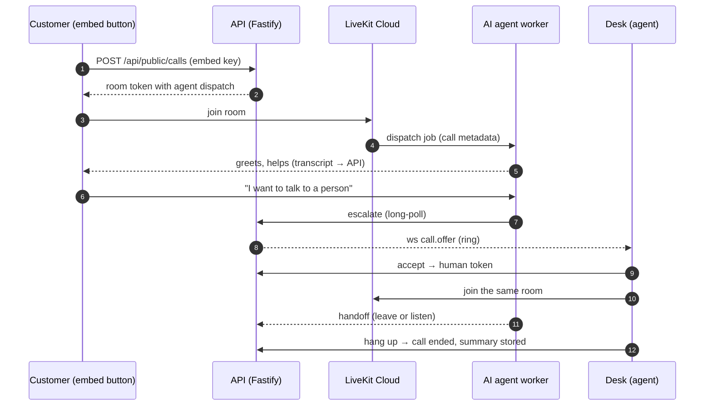

<div align="center">

# Patchbay Contact Center

**An AI-first contact center on LiveKit Cloud — the AI answers, humans take over.**

A "Call us" button for any website, a voice AI that picks up first, a React desk where
human agents and supervisors take over live calls, and every conversation stored in
Postgres for the next LLM to act on.

[](https://github.com/ggcaponetto/patchbay-contact-center/actions/workflows/ci.yml)
[](https://ggcaponetto.github.io/patchbay-contact-center/)
[](https://github.com/ggcaponetto/patchbay-contact-center/actions/workflows/sast.yml)
[](https://github.com/ggcaponetto/patchbay-contact-center/actions/workflows/dast.yml)
[](https://github.com/ggcaponetto/patchbay-contact-center/releases)
[](https://codecov.io/gh/ggcaponetto/patchbay-contact-center)
[](https://sonarcloud.io/summary/new_code?id=ggcaponetto_livekit-playground)
[](https://sonarcloud.io/summary/overall?id=ggcaponetto_livekit-playground)
[](https://github.com/ggcaponetto/patchbay-contact-center/actions/workflows/e2e-nightly.yml)
[](https://github.com/ggcaponetto/patchbay-contact-center/blob/main/LICENSE)
[](https://nodejs.org)
[](https://docs.livekit.io/agents/)

**[Getting started](docs/guide/getting-started.md)** ·
[Documentation](https://ggcaponetto.github.io/patchbay-contact-center/) ·
[Architecture](docs/guide/architecture.md) ·
[Roadmap](docs/guide/roadmap.md) ·
[API Reference](https://ggcaponetto.github.io/patchbay-contact-center/docs/api/)

</div>

---

## What it does

- **Embeddable call button** — `<cc-call-button>` web component, one `<script>` tag, WebRTC audio through LiveKit.
- **AI answers first** — a LiveKit Agents voice pipeline (STT → LLM → TTS, turn detection, noise cancellation) greets the caller, helps, and calls an `escalateToHuman` tool when a person is needed. Per tenant you can flip to **human-first** with the AI as fallback.
- **Human agents & supervisors** — React + MUI desk with Google sign-in (Better Auth): availability, ring-one-agent-at-a-time routing, in-call panel with live transcript, supervisor dashboard, listen-in / take-over, settings, history.
- **Same-room handoff** — the human joins the customer's LiveKit room; the AI either leaves (and keeps transcribing) or stays muted and listens.
- **Everything persisted** — calls, participants, full transcripts (AI and human segments) and an event log in Postgres, plus an LLM summary per call. Multi-tenant from day one.

## How it works



Deeper dives: [Architecture](docs/guide/architecture.md) · [Call lifecycle](docs/guide/call-lifecycle.md) · per-app docs next to the code: [API](apps/api/README.md) · [AI agent](apps/agent/README.md) · [Web desk](apps/web/README.md) · [Embed](apps/embed/README.md) · [Shared contracts](packages/shared/README.md).

## Getting started

**Prerequisites:** Node ≥ 24 and npm ≥ 11, Docker (Postgres), the [LiveKit CLI](https://docs.livekit.io/intro/basics/cli/) with a [LiveKit Cloud](https://cloud.livekit.io/) project, and optionally a Google OAuth client.

```sh
git clone https://github.com/ggcaponetto/patchbay-contact-center.git
cd patchbay-contact-center
npm install
cp .env.example .env.local                 # fill in the values (see below)
lk cloud auth && lk app env -w -d .env.local   # LIVEKIT_URL / API_KEY / API_SECRET
docker compose up -d                       # Postgres on localhost:5432
```

Minimum `.env.local` besides the LiveKit values:

| Variable                                    | Purpose                                                                            |
| ------------------------------------------- | ---------------------------------------------------------------------------------- |
| `DATABASE_URL`                              | `postgres://cc:cc@localhost:5432/cc` (matches `docker-compose.yml`)                |
| `INTERNAL_API_SECRET`                       | shared secret between the agent worker and the API                                 |
| `ADMIN_EMAILS`                              | who becomes supervisor of a fresh tenant on first login                            |
| `BETTER_AUTH_SECRET`                        | random string (≥ 32 chars)                                                         |
| `GOOGLE_CLIENT_ID` / `GOOGLE_CLIENT_SECRET` | OAuth client; redirect URI `http://localhost:3000/api/auth/callback/google`        |
| `DEV_USER_EMAIL`                            | _dev only_: skip Google; the desk gets a "switch user" menu and a seeded demo team |

Start everything with one command (color-coded output via `concurrently`), or each app in its own terminal:

```sh
npm run dev          # api + web + agent + embed together

npm run dev:api      # http://localhost:4000  (set PORT / API_PORT if 4000 is taken)
npm run dev:web      # http://localhost:3000  agent & supervisor desk
npm run dev:agent    # registers the AI agent "cc-agent" with LiveKit Cloud
npm run dev:media    # media worker: music on hold
npm run dev:embed    # http://localhost:3001  demo page with the call button
```

Then: sign in on the desk → **Settings → Call button → Create key** → open
`http://localhost:3001/?key=pk_…` → press **Call us** and talk to the AI. Ask for a
person while you are **Available** on the desk and watch the ring come in. The full
walkthrough, env var reference and troubleshooting are in
[Getting started](docs/guide/getting-started.md).

## Repository layout

| Path              | What                                                                                           |
| ----------------- | ---------------------------------------------------------------------------------------------- |
| `apps/api`        | Fastify API: Better Auth, LiveKit tokens & dispatch, routing, desk WebSocket, Drizzle/Postgres |
| `apps/agent`      | LiveKit Agents worker on LiveKit Inference; escalation & hang-up tools, transcriber            |
| `apps/media`      | Media worker: server-side audio (music on hold) over the Postgres bus                          |
| `apps/web`        | Vite + React 19 + MUI desk for agents and supervisors                                          |
| `apps/embed`      | `<cc-call-button>` web component, built to a single `call-button.js`                           |
| `apps/mcp`        | MCP server: every API operation as a tool for LLM clients, keyed by an API key                 |
| `packages/shared` | zod contracts shared by every app (settings, statuses, WebSocket protocol)                     |
| `tests/`          | Playwright end-to-end (`e2e/`) and Artillery load (`load/`) suites                             |
| `docs/`           | Hand-written guides (`guide/`) and the generated API reference (`api/`)                        |
| `build/`          | Repo tooling (LOC budget gate, SAST/DAST scanners)                                             |

Plain **npm workspaces**; Node runs TypeScript directly (type stripping) so there is no build step in the dev loop.

## Scripts

| Command                    | What                                                                                   |
| -------------------------- | -------------------------------------------------------------------------------------- |
| `npm run validate`         | everything CI runs: prettier, eslint, tsc, knip, cspell, LOC gate, tests, builds, docs |
| `npm test`                 | unit + integration tests with the 90 % coverage gate (integration needs Postgres)      |
| `npm run test:unit`        | unit tests only — `*.test.ts` next to the sources, no services needed                  |
| `npm run test:integration` | `*.integration.test.ts` — Postgres routes/flow, LLM-as-judge agent evals               |
| `npm run test:e2e`         | Playwright `core` tier against the real stack, AI played via the internal API          |
| `npm run test:e2e:smoke`   | the `@smoke` subset, under a minute; `test:e2e:cloud` drives the real agent (LiveKit)  |
| `npm run e2e-plan`         | checks `tests/e2e/TEST-PLAN.md` against the tagged specs (part of `validate`)          |
| `npm run test:load`        | Artillery HTTP + WebSocket profile against a running API on :4100 (opt-in)             |
| `npm run sast`             | static security scan: `npm audit` (prod deps) + Semgrep via Docker                     |
| `npm run dast`             | dynamic security scan: boots the API, OWASP ZAP baseline via Docker (needs Postgres)   |
| `npm run docs:dev`         | VitePress docs site with the typedoc API reference and mermaid diagrams                |
| `npm run build`            | production builds of the web desk and the embed script                                 |
| `npm run loc`              | size report: product code against 50k (POC target 20k), tests against their own 50k    |

## Quality gates

Every push runs `validate` on Linux, Windows and macOS: Prettier, ESLint, `tsc` per
workspace, [knip](https://knip.dev) (dead code and dependencies), cspell, the LOC gate,
the e2e test-plan gate, vitest with **90 % coverage** on logic modules, the Vite builds,
and the docs build — where typedoc **fails on any undocumented export** and VitePress
fails on dead links. Playwright runs the `smoke` and `core` end-to-end tiers on every
push and PR, and the `cloud` tier (real AI agent on LiveKit Cloud) on `main` and nightly;
one test per feature, tracked in [tests/e2e/TEST-PLAN.md](tests/e2e/TEST-PLAN.md).
Husky runs Prettier + typecheck on commit and `validate` on push. On `main`, two more
workflows run the **SAST** (`npm audit` + Semgrep) and **DAST** (OWASP ZAP baseline against
the booted API) scanners — the same `npm run sast` / `npm run dast` you can run locally with
Docker. Codecov and SonarCloud track trends (informational). Details:
[Quality gates](docs/guide/quality-gates.md).

Development follows **git flow** (`develop` integrates, `main` only receives releases and
hotfixes) and releases are tagged with **semantic versioning** (`v0.1.0`); see
[Releasing](docs/guide/releasing.md).

## Documentation

The docs are a VitePress site built from this repository — every folder's `README.md`
is a page, so architecture notes live next to the code they describe:

- **Guides:** [Getting started](docs/guide/getting-started.md), [Architecture](docs/guide/architecture.md), [Call lifecycle](docs/guide/call-lifecycle.md), [Testing](docs/guide/testing.md), [Quality gates](docs/guide/quality-gates.md), [Releasing](docs/guide/releasing.md), [Deployment](docs/guide/deployment.md), [Glossary](docs/guide/glossary.md)
- **Apps:** [API](apps/api/README.md) (+ [core modules](apps/api/src/README.md), [routes](apps/api/src/routes/README.md), [services](apps/api/src/services/README.md), [database](apps/api/src/db/README.md)), [AI agent](apps/agent/README.md), [Web desk](apps/web/README.md), [Embed button](apps/embed/README.md), [Shared contracts](packages/shared/README.md), [Tests](tests/README.md)
- **API reference:** generated by typedoc from the TSDoc comments (`npm run docs:api`)

## Deployment

The `Dockerfile` builds the agent worker for [LiveKit Cloud agent deployment](https://docs.livekit.io/deploy/agents/)
(`lk agent create` / `lk agent deploy`). The API is a plain Node 24 process with Postgres
(migrations run at boot); the web desk is a static Vite build that must share an origin
with the API (or proxy `/api`) for cookies; the embed script is served by the API at
`/embed/call-button.js`. Never set `DEV_USER_EMAIL` in production. See
[Deployment](docs/guide/deployment.md).

## Project status

Working end to end against LiveKit Cloud, all five roadmap phases shipped (v0.2.0):
embedded call → AI → escalation → human in the same room, full agent call control (hold
with music, transfers and consultations, recording via Egress, dispositions and wrap-up),
supervisor tools (whisper / barge / intercept, messaging and ticker, wallboard with
threshold alerts), skills-based routing with selection algorithms and business hours, and
an MCP server exposing every API operation as a tool. Verified by unit, integration and
Playwright e2e suites. What is deliberately later (SIP/PSTN, omnichannel, callbacks,
ring-all) is in the [Roadmap](docs/guide/roadmap.md); open items in [TODO.md](TODO.md).

## Contributing

Issues and PRs are welcome. Read [CONTRIBUTING.md](CONTRIBUTING.md) for setup, the
`npm run validate` gate and conventions (tests next to sources, TSDoc on every export,
a `README.md` per folder), and mind the [Code of Conduct](CODE_OF_CONDUCT.md).
Branching and versioning: [Releasing](docs/guide/releasing.md). Security issues: see
[SECURITY.md](SECURITY.md).

## License

[MIT](https://github.com/ggcaponetto/patchbay-contact-center/blob/main/LICENSE) © 2026 Giuseppe Giulio Caponetto
