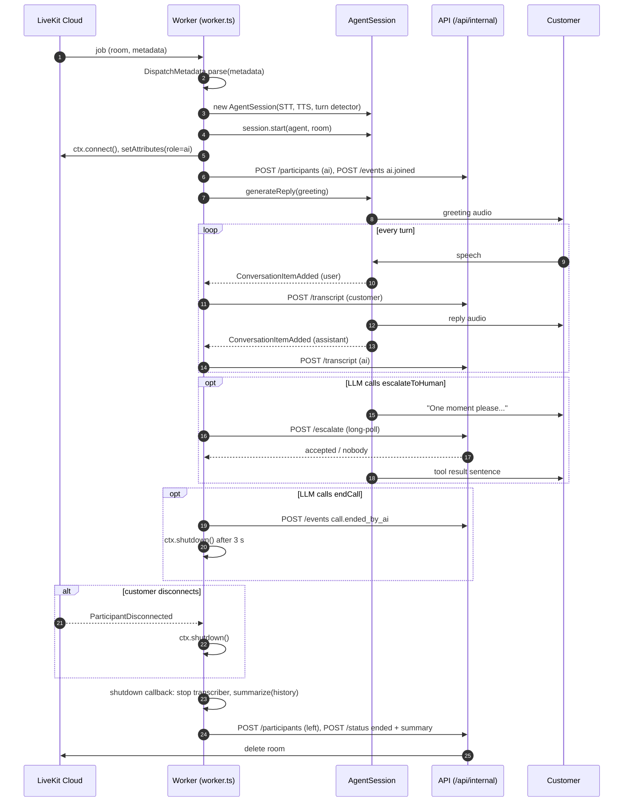
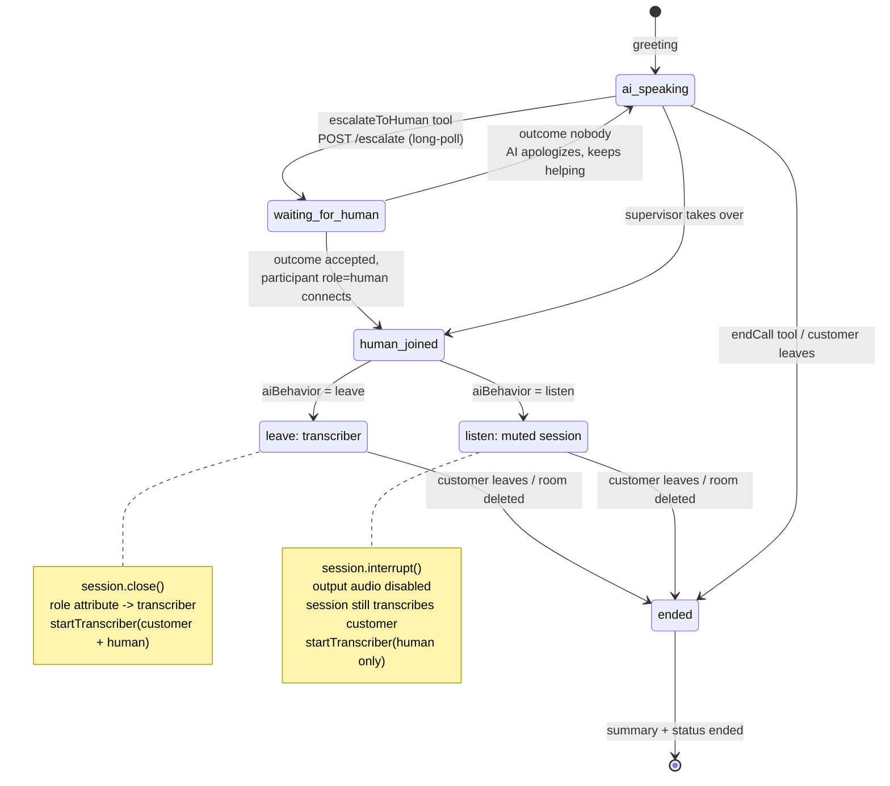

# AI agent worker (`apps/agent`)

The worker is the voice AI of the contact center. It is a [LiveKit Agents for Node.js](https://docs.livekit.io/agents/) (SDK 1.7) process that connects to LiveKit Cloud, waits for _jobs_, and for each job joins the call's room as the participant `ai:<callId>`, talks to the customer, and reports everything back to the API over HTTP. It has no database and no websocket: the API is its only backend.

One process handles many calls at once; every call is one invocation of the `entry()` function built by `createEntry()` in `src/worker.ts`. `src/main.ts` is only the process entry point: it loads `.env.local`, defines the agent with `createEntry()` and starts the LiveKit CLI.

## How a job reaches the worker

The worker registers with the agent name `cc-agent` (`AGENT_NAME` in `src/worker.ts`, mirrored in `apps/api/src/livekit.ts`). It is only started by **explicit dispatch**; LiveKit never auto-dispatches it into rooms. Two code paths in the API trigger it:

| Tenant routing mode | How the dispatch happens                                                                                                                                                                                                        | Where              |
| ------------------- | ------------------------------------------------------------------------------------------------------------------------------------------------------------------------------------------------------------------------------- | ------------------ |
| `ai-first`          | The customer's access token carries a `RoomConfiguration` with a `RoomAgentDispatch` for `cc-agent`. When the customer connects and the room is created, LiveKit dispatches the worker immediately.                             | `routes/public.ts` |
| `human-first`       | The API rings human agents first. If nobody accepts within `humanFirstTimeoutSec`, `Flow.nobody` calls the AgentDispatch API (`AgentDispatchClient.createDispatch`) with the same metadata, and the worker joins as a fallback. | `flow.ts`          |

In both cases the dispatch carries a JSON string that parses as `DispatchMetadata` from `@cc/shared`: call id, tenant id, queue key, a snapshot of the tenant settings and the customer metadata. That is all the worker knows about the call.

## Job lifecycle



Notes for the diagram:

- Step 4 starts the pipeline _before_ `ctx.connect()` so no customer audio is missed.
- Transcript segments are "committed" messages only: interim STT results never leave the worker.
- The shutdown callback runs on every exit path, including the API deleting the room (which happens when the human agent hangs up). `summarize()` failures are swallowed so the status update always goes out.

## Handoff to a human

When a participant with the attribute `role=human` appears (a desk agent accepting an escalation, or a supervisor taking over), the worker applies the tenant's `handoff.aiBehavior`. The decision is made once per call (`handedOff` flag).



Differences between the two modes that matter in practice:

|                                      | `leave`                            | `listen`                                   |
| ------------------------------------ | ---------------------------------- | ------------------------------------------ |
| AI can speak again                   | No, the session is closed          | No, output audio is disabled               |
| `session.history` at shutdown        | Frozen at handoff time             | Keeps the customer's later turns           |
| Participant kind reported to the API | `ai` left, `transcriber` added     | stays `ai`                                 |
| Transcriber covers                   | customer and human                 | human only (session covers the customer)   |
| Cost                                 | one STT stream per remaining track | session STT + one STT stream for the human |

## Tools

Both tools are declared in `src/agent.ts`; their side effects are injected as `AgentActions` so the evals can stub them. The base prompt tells the model to repeat the tool result to the caller verbatim.

| Tool              | Parameters                                               | When the LLM should call it                                                                               | What it returns to the LLM                                                                                                                                 |
| ----------------- | -------------------------------------------------------- | --------------------------------------------------------------------------------------------------------- | ---------------------------------------------------------------------------------------------------------------------------------------------------------- |
| `escalateToHuman` | `reason` (few words), `summary` (two or three sentences) | The caller asks for a person, a real agent or a supervisor, or the request is outside what the AI can do. | `"Tell the caller that <name> is joining the call now."` when a human accepted, or an instruction to apologize and keep helping when nobody was available. |
| `endCall`         | none                                                     | The caller says goodbye, or confirms there is nothing else.                                               | `"Say a brief, friendly goodbye. The call ends in a few seconds."`; the worker schedules `ctx.shutdown()` 3 s later.                                       |

While `escalateToHuman` is pending the worker says "One moment please, I am connecting you to a colleague." via `session.say`, because the long-poll can take `offerTimeoutSec` × (number of agents) seconds.

## Models

Everything runs on [LiveKit Inference](https://docs.livekit.io/agents/models/inference), so there are no provider API keys: the `LIVEKIT_*` credentials cover all of them.

| Role               | Model                                                                    | Where to change                                                          |
| ------------------ | ------------------------------------------------------------------------ | ------------------------------------------------------------------------ |
| STT                | `assemblyai/universal-3-5-pro`, English                                  | `STT_MODEL` in `src/worker.ts` (used by the session and the transcriber) |
| TTS                | `fishaudio/s2.1-pro`, fixed voice id                                     | `inference.TTS({...})` in `defaultDeps()`, `src/worker.ts`               |
| LLM                | `google/gemma-4-31b-it`                                                  | `LLM_MODEL` in `src/agent.ts` (conversation and summary)                 |
| Turn detection     | LiveKit turn detector (`inference.TurnDetector`), adaptive interruptions | `turnHandling` in `defaultDeps()`, `src/worker.ts`                       |
| Noise cancellation | ai-coustics `QuailVfS` via `@livekit/plugins-ai-coustics`                | `inputOptions()` in `defaultDeps()`, `src/worker.ts`                     |
| Eval judge         | `openai/gpt-4.1-mini`                                                    | `judgeLlm` in `src/agent.integration.test.ts`                            |

`expressive: true` on the session lets the LLM annotate its output with prosody hints for the TTS. Noise cancellation and expressive mode are LiveKit Cloud features.

## Environment variables

Loaded by `dotenv` from `.env.local` in the workspace folder or the repository root (see `.env.example`).

| Variable              | Purpose                                                                                                     | Default                 |
| --------------------- | ----------------------------------------------------------------------------------------------------------- | ----------------------- |
| `LIVEKIT_URL`         | LiveKit Cloud project URL (`wss://...`)                                                                     | required                |
| `LIVEKIT_API_KEY`     | API key of the project; also authenticates LiveKit Inference                                                | required                |
| `LIVEKIT_API_SECRET`  | API secret of the project                                                                                   | required                |
| `API_ORIGIN`          | Origin of the API the worker reports to                                                                     | `http://localhost:4000` |
| `INTERNAL_API_SECRET` | Shared secret sent as `x-internal-secret`; must equal the API's value or every internal request returns 401 | `''`                    |

## Running

From the repository root:

```console
npm run dev:agent                      # worker with hot reload, connects to LiveKit Cloud and waits for jobs
npm run -w apps/agent start            # production mode (what the Dockerfile runs)
npm run -w apps/agent console          # talk to the agent through your microphone, no room or API needed
```

`console` mode still needs the `LIVEKIT_*` variables for inference, but it does not parse `DispatchMetadata`, so it only exercises the pipeline, not the call logic. The API must be running for transcripts, escalation and status updates to work in `dev`/`start` mode; failures are logged to stderr and otherwise ignored.

## Evals

`src/agent.integration.test.ts` contains behavioral tests that use the LiveKit Agents [testing framework](https://docs.livekit.io/agents/start/testing/). They talk to LiveKit Inference, so they run under the `integration` vitest project and skip themselves when `LIVEKIT_API_KEY` / `LIVEKIT_API_SECRET` are missing (for example in CI without secrets).

```console
npm run test:integration               # all integration suites
npx vitest run apps/agent              # only this workspace
```

How a test works:

1. `beforeEach` builds a text-only `voice.AgentSession` (no STT/TTS) around `createAgent(...)` with `vi.fn` stubs for `escalate` and `endCall`.
2. `session.run({ userInput: '...' }).wait()` feeds one user turn and returns a `RunResult` once the agent is idle.
3. Assertions are made on the ordered list of events the agent produced. The `RunResult.expect` API offers:
   - `nextEvent()` to step through events in order, or `containsFunctionCall({ name })` / `containsMessage({ role })` to find one anywhere;
   - `.isMessage({ role })` / `.isFunctionCall(...)` type checks on the current event;
   - `.judge(llm, { intent })` to have a judge LLM grade whether the message fulfils the intent (this is what makes the tests robust to wording);
   - `noMoreEvents()` to assert the turn is complete.
4. The stubs (`actions.escalate.mock.calls`) are inspected to assert the tool arguments.

To add an eval, copy one of the existing `it` blocks and change the user input, the expected tool and the judge intent:

```ts
it('asks for the order number before looking it up', { timeout: 30000 }, async () => {
  const result = await session.run({ userInput: 'My order never arrived.' }).wait();
  await result.expect
    .nextEvent()
    .isMessage({ role: 'assistant' })
    .judge(judgeLlm, { intent: 'Asks the caller for their order number.' });
  result.expect.noMoreEvents();
  expect(actions.escalate).not.toHaveBeenCalled();
});
```

Per `AGENTS.md`, write the eval first and then iterate on the prompt or tool description until it passes. Multi-turn conversations are just consecutive `session.run` calls on the same session; `summarize()` can be tested on `session.history` afterwards (see "summarizes a conversation").

## Unit tests

Everything except the models themselves is covered by unit tests that need no credentials (`npm run test:unit`). `createEntry(deps)` takes every collaborator as a factory (`WorkerDeps`), so `worker.test.ts` drives a whole call with an `EventEmitter` room, a fake session and a spy API client: start order, transcript forwarding, both handoff modes, `escalate`/`endCall` and the shutdown callback. `defaultDeps()` is exercised with stub credentials; the inference constructors do not connect until a job runs.

## Transcriber

`src/transcriber.ts` exists because a `voice.AgentSession` only transcribes the participant it is talking to. After a handoff the desk still needs a transcript of the human side (and, in `leave` mode, of the customer too), so `startTranscriber` subscribes to the raw remote audio tracks of the selected participants, pulls 16 kHz mono frames with `AudioStream` from `@livekit/rtc-node`, pushes them into `stt.stream()` and posts every `FINAL_TRANSCRIPT` to the API. It returns a stop function that the shutdown callback calls.

Limits to be aware of:

- One STT stream per track, so cost scales with the number of transcribed participants. Supervisors are never transcribed (they cannot publish audio anyway).
- No turn detection or VAD: segmentation is whatever the STT provider decides, so lines can be longer or shorter than a conversational turn.
- `startMs`/`endMs` of `TranscriptSegmentInput` are not filled in; ordering on the desk is arrival order.
- Segments from two people speaking at once are independent and may interleave.
- A `FINAL_TRANSCRIPT` that arrives after `stop()` is dropped, so the very last words before shutdown can be lost.
- The STT instance passed in must be fresh per call; streams are not shareable.

## Files

| File                            | Purpose                                                                                                                                                                                           |
| ------------------------------- | ------------------------------------------------------------------------------------------------------------------------------------------------------------------------------------------------- |
| `src/main.ts`                   | Process entry: loads `.env.local`, `defineAgent({ entry: createEntry() })`, starts the CLI (`dev`/`start`/`console`).                                                                             |
| `src/worker.ts`                 | Job logic: `createEntry(deps)` parses dispatch metadata, builds the `AgentSession`, streams transcripts, handles the handoff and shutdown; `defaultDeps()` wires the real models and `ApiClient`. |
| `src/agent.ts`                  | `createAgent` (base prompt + tenant instructions, `escalateToHuman` and `endCall` tools), `summarize`, `LLM_MODEL`.                                                                               |
| `src/api.ts`                    | `ApiClient` for `POST /api/internal/calls/:id/{transcript,events,participants,escalate,status}`; logs instead of throwing.                                                                        |
| `src/transcriber.ts`            | `startTranscriber`: STT over raw remote audio tracks after the handoff.                                                                                                                           |
| `src/agent.integration.test.ts` | LLM-judge evals; skipped without LiveKit credentials.                                                                                                                                             |
| `src/api.test.ts`               | Unit tests for `ApiClient` with a stubbed `fetch`.                                                                                                                                                |
| `src/worker.test.ts`            | Unit tests for the job logic with fake context, room, session and API (no credentials).                                                                                                           |
| `src/agent.test.ts`             | Unit tests for the prompt, the tools' `execute` functions and `summarize` with a fake LLM.                                                                                                        |
| `src/transcriber.test.ts`       | Unit tests for `startTranscriber` with a mocked `@livekit/rtc-node`.                                                                                                                              |
| `src/main.test.ts`              | Smoke test of the entry point with `cli.runApp` stubbed.                                                                                                                                          |
| `package.json`                  | Scripts `dev`, `start`, `console`, `typecheck`; depends on `@cc/shared`, `@livekit/agents`, `@livekit/rtc-node`, `@livekit/plugins-ai-coustics`.                                                  |

Related: [`packages/shared`](../../packages/shared/) for the contracts, `apps/api/src/routes/internal.ts` for the server side of `ApiClient`, `apps/api/src/flow.ts` for escalation and dispatch.
