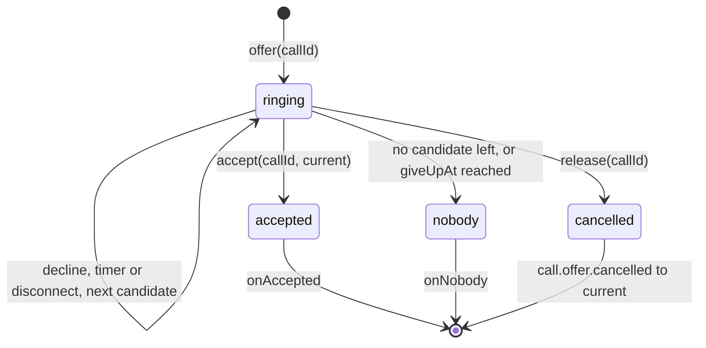
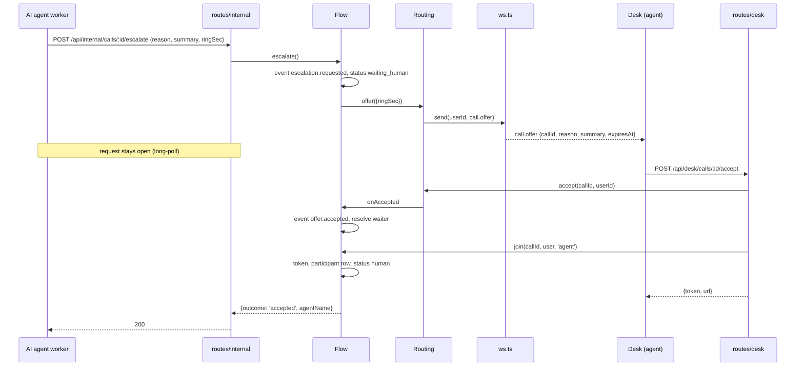
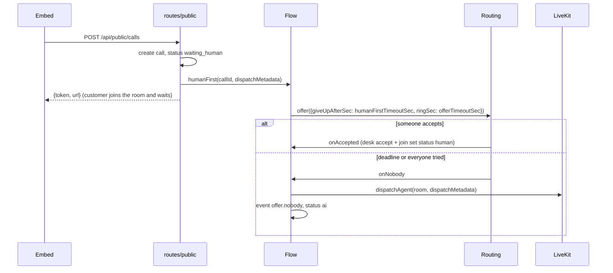

# Core modules (`apps/api/src`)

The files directly in `src/` are the engine of the API: boot and composition, auth,
LiveKit access, and the three modules that move a call between the AI and humans
(`routing.ts`, `flow.ts`, `ws.ts`). Routes, services and the database live in their own
folders with their own READMEs.

| File         | Role                                                                 |
| ------------ | -------------------------------------------------------------------- |
| `index.ts`   | Process entrypoint: env, migrations, real dependencies, listen       |
| `server.ts`  | `buildServer`: composition root and the `authenticate` preHandler    |
| `auth.ts`    | Better Auth (Google) and the `DEV_USER_EMAIL` bypass                 |
| `livekit.ts` | `LiveKit` interface: tokens, agent dispatch, delete room             |
| `routing.ts` | In-memory presence and ring-offer state machine (no I/O)             |
| `flow.ts`    | Orchestrator: escalation long-poll, human-first fallback, join/leave |
| `ws.ts`      | `/api/ws` websocket protocol and `DeskSockets` fan-out               |
| `testing.ts` | Test helpers (fake LiveKit, test server, fresh database)             |

## `routing.ts`: presence and offers

`Routing` holds two maps and nothing else: `agents` (one `Presence` per connected desk
user) and `offers` (one per call currently ringing). It talks back through
`RoutingEvents` callbacks, which `Flow` implements. Because it does no I/O and takes an
injectable clock, `routing.test.ts` drives it with fake timers.

### Presence rules

- `ws.ts` calls `setPresence` when a desk connects (initially `away`) and on every
  `status` message; `removePresence` when the user's last socket closes.
- `setPresence` keeps the agent's current `callId`, so changing status while on a call
  does not free the agent.
- An agent is a **candidate** for an offer when: same tenant, status `available`,
  `callId === null`, member of the offer's queue, not already tried for this offer, and
  not currently being rung for another call. The first match in insertion order is taken;
  there is no load balancing.
- `accept` sets the agent to `busy` with that `callId`; `release` (call ended or a desk
  participant left) sets them back to `available`.

### Life of an offer

Each step (`advance`) cancels the current agent (`call.offer.cancelled`), adds them to
`tried`, picks the next candidate, sends `call.offer` with an `expiresAt`, and arms a
timer. Two timings: `ringSec` (per agent, from `offerTimeoutSec` in tenant settings or
the escalation body) and the optional `giveUpAfterSec` deadline for the whole cycle used
by human-first mode; the last agent's ring is shortened so it never passes the deadline.

Presence is process memory: a restart forgets everyone and desks simply reconnect.

## `flow.ts`: orchestration

`Flow` owns the single `Routing` instance and is the only module that combines routing,
the database (`services/calls.ts`) and LiveKit. Every status write goes through its
private `status()`, which persists and emits `call.updated` on the hub.

### Escalation (AI → human)

The worker's HTTP request is held open until the outcome is known, which is why the
`Waiter` map exists: `escalate` stores the promise's `resolve`, and `accepted` / `nobody`
/ `end` resolve it exactly once. If every agent declines or times out, the outcome is
`nobody`, the call goes back to `ai`, and the AI tells the caller no one is available.

### Human-first with AI fallback

In `ai-first` mode there is no ringing at creation: the AI is dispatched through the
customer token's room configuration and only rings humans later via `escalate`.

### Join, leave, end

- `join(callId, user, mode)`: mints a token (`agent` and `takeover` publish, `listen` is
  subscribe-only), records the participant and a `<mode>.joined` event; `agent` and
  `takeover` set the status to `human`. Returns `undefined` for ended calls.
- `leave(callId, user, role)`: stamps `leftAt`, releases the agent in routing; a `human`
  leaving ends the call.
- `end(callId)`: deletes the LiveKit room, sets `ended`, stops ringing, resolves a pending
  escalation with `nobody`. Idempotent.

## `ws.ts`: the desk websocket

### Connection lifecycle

1. Client opens `ws(s)://<api>/api/ws?tenantId=<id>` with the session cookie.
2. The server resolves the session and membership. Failure → close code `4401`.
3. The connection is added to `DeskSockets`, the user's queue keys are loaded once, and
   presence is set to `away`.
4. Messages are parsed with `ClientMessage` (zod); anything else is dropped silently.
5. On close the socket is removed; presence is removed only when it was the user's last
   socket, which also moves any offer ringing them to the next agent.

Queue membership is read at connect time: after a supervisor changes queue members, the
agent must reconnect (reload the desk) to ring for the new queue.

### Client → server

| `type`          | Fields                          | Effect                                               |
| --------------- | ------------------------------- | ---------------------------------------------------- |
| `status`        | `status: available\|busy\|away` | `Routing.setPresence`; only `available` gets offers  |
| `subscribe`     | `callId`                        | Receive `transcript` messages for that call          |
| `offer.decline` | `callId`                        | `Routing.decline`; the offer moves to the next agent |

Accepting is **not** a socket message: `POST /api/desk/calls/:id/accept` returns the
LiveKit token.

### Server → client

| `type`                 | Audience              | Fields                                                         | Emitted by                                       |
| ---------------------- | --------------------- | -------------------------------------------------------------- | ------------------------------------------------ |
| `presence`             | whole tenant          | `agents[]: {userId, name, status, callId}`                     | hub `presence` (Routing)                         |
| `call.offer`           | one user              | `callId, queueKey, reason?, summary?, expiresAt`               | Routing via `DeskSockets.toUser`                 |
| `call.offer.cancelled` | one user              | `callId`                                                       | Routing (timeout, decline, release)              |
| `call.updated`         | whole tenant          | `callId, status`                                               | hub `call.updated` (Flow, internal status route) |
| `transcript`           | subscribers of a call | `callId, segment: {speaker, identity, text, startMs?, endMs?}` | hub `transcript` (internal transcript route)     |

### Why early messages are buffered

`ws` delivers a message only if a `message` listener is attached at that moment. The
handler `await`s the session and membership lookups before it is ready, and a desk sends
`status` right after `open`, so without a buffer the first message would be lost and the
agent would stay `away`. The handler therefore attaches a listener immediately that
pushes into `inbox.early` until `inbox.handle` exists, then replays the buffer in order.

## `auth.ts`

- `createAuth(db)` configures Better Auth with the Google provider and the Drizzle
  adapter over the `user` / `session` / `account` / `verification` tables. `baseURL` is
  `WEB_ORIGIN` because the web app proxies `/api` to the API, so cookies and OAuth
  redirects are all on the web origin.
- `registerAuth(app, auth)` mounts `/api/auth/*` by translating Fastify requests to Fetch
  `Request`s and copying the `Response` back, and returns a `GetSession` that validates the
  cookie on every request.
- **First-login bootstrap**: the `user.create.after` hook calls `bootstrapUser`
  (services/tenants.ts): pending invites become memberships, and `ADMIN_EMAILS` users with
  no membership get their own tenant.
- **Dev bypass** `devAuth`: with `DEV_USER_EMAIL` set (and `NODE_ENV !== 'production'`),
  the user row is created and bootstrapped once and every request, HTTP or websocket, is
  that user; `/api/auth/get-session` and `/api/auth/sign-out` are stubbed so the web
  client works unchanged. It is safe only in development because the resolver ignores
  headers entirely: whoever reaches the port is that user.

## `livekit.ts`

- `createToken` signs a 2-hour JWT with `roomJoin` on one room, the participant
  `identity` / `name`, and `attributes` (`role`, `userId`, `displayName`) that every peer
  can read to know who is who. `canPublish: false` is used for supervisors listening.
- **Dispatch via room config**: when `dispatchMetadata` is given, the token carries a
  `RoomConfiguration` with a `RoomAgentDispatch` for `cc-agent`. LiveKit starts the
  worker when the customer's connection creates the room. Used for `ai-first`.
- **Dispatch via API**: `dispatchAgent(room, metadata)` calls `AgentDispatchClient` for a
  room that already exists. Used when human-first ringing gives up.
- `deleteRoom` disconnects everyone; errors are swallowed because the room may already be
  gone.

Identities follow `<role>:<id>`: `customer:<callId>`, `ai:<callId>` (set by the worker),
`human:<userId>`, `supervisor:<userId>`.

## `server.ts`

`buildServer(deps)` registers, in order: CORS, `/api/health`, the built embed bundle at
`/embed/` (if `apps/embed/dist` exists), the auth strategy, `/api/me`, the event hub,
`DeskSockets`, `Flow`, the four route groups and the websocket. It returns `{ app, hub,
flow }` without listening. See the [API README](../README.md) for dependency injection
and the request lifecycle.

## `testing.ts`

`testServer(db, adminEmails?, resolve?)` builds a real server with `fakeLiveKit()` and a
session resolver you control (`srv.as(user).inject(...)`). `freshDb()` migrates and
truncates the test database; `dbAvailable()` lets integration suites skip when Postgres
is down. `fakeLiveKit()` records `tokens`, `dispatched` and `deleted` for assertions.

## `index.ts`

Loads `.env.local`, runs migrations, creates the database pool and LiveKit client, picks
the auth strategy (`DEV_USER_EMAIL` outside production, Better Auth otherwise), calls
`buildServer` and listens on `PORT`.
