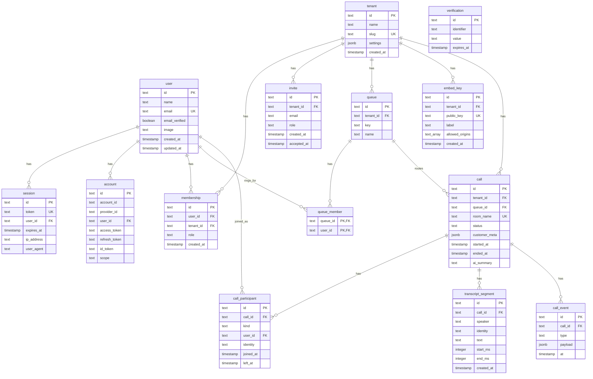

# Database (`apps/api/src/db`)

| File         | Role                                                                        |
| ------------ | --------------------------------------------------------------------------- |
| `schema.ts`  | Drizzle table definitions; the single source of truth for the schema        |
| `client.ts`  | `createDb()`: `pg` pool + Drizzle, and the `Db` type everything depends on  |
| `migrate.ts` | `runMigrations()`: applies `apps/api/drizzle/*.sql`; also runnable directly |

## Tables

`user`, `session`, `account` and `verification` are Better Auth's tables (generated
shape; keep column names as they are). The rest is the contact center domain.

Constraints worth knowing:

| Constraint                               | Why                                                        |
| ---------------------------------------- | ---------------------------------------------------------- |
| `membership (user_id, tenant_id)` unique | one role per user per tenant; `bootstrapUser` relies on it |
| `invite (tenant_id, email)` unique       | re-inviting updates the row (`onConflictDoUpdate`)         |
| `queue (tenant_id, key)` unique          | the embed addresses queues by key                          |
| `queue_member (queue_id, user_id)` PK    | no duplicate memberships                                   |
| `call.room_name` unique                  | one LiveKit room per call                                  |
| `embed_key.public_key` unique            | lookups from the public route                              |
| `call.queue_id` no cascade               | a queue with call history cannot be deleted silently       |
| every other FK `ON DELETE CASCADE`       | deleting a tenant or call removes its children             |

Indexes: `call (tenant_id, started_at)`, `transcript_segment (call_id, created_at)`,
`call_event (call_id, at)`, plus Better Auth's `user_id` / `identifier` indexes.

## Conventions

- **Ids are `text` UUIDs** generated in application code with `randomUUID()`, never by
  the database. The public route needs the call id before the insert to derive the room
  name and participant identities.
- **Timestamps** default to `now()`; `updated_at` columns use Drizzle's `$onUpdate`.
- **`jsonb` is validated at the edge**: `tenant.settings` is typed as
  `Record<string, unknown>` in the schema and parsed with `TenantSettings` (zod, from
  `@cc/shared`) in `getTenant` / `updateSettings`, so defaults are applied on read and
  invalid patches are rejected before the write. `customer_meta` and `call_event.payload`
  are opaque.
- **Enums are `text` with a TypeScript `$type`** (`membership.role`, `call.status`,
  `call_participant.kind`); the allowed values live in the zod enums of `@cc/shared`.
- **Tenant scoping is done in queries**, not in the database: services always filter by
  `tenant_id`.

## Migration workflow

1. Edit `src/db/schema.ts`.
2. From `apps/api`, run `npx drizzle-kit generate` (config in `drizzle.config.ts`, reads
   `DATABASE_URL` only for the dialect credentials). This writes a new
   `drizzle/<n>_<name>.sql` plus `drizzle/meta/*` snapshot files. Commit them together.
3. Migrations are applied automatically: `index.ts` calls `runMigrations()` before the
   server starts, and `testing.ts` calls it in `freshDb()`. To apply by hand:
   `node src/db/migrate.ts` in `apps/api`.
4. Drizzle tracks applied files in its own `__drizzle_migrations` table; re-running is safe.

Never edit a migration that has already been applied somewhere; generate a new one.

## Client

`createDb(connectionString = DATABASE_URL)` returns `{ db, close }`. `index.ts` creates
one pool for the process; `runMigrations` opens and closes its own. Tests connect to
`DATABASE_URL_TEST` when set (see `testing.ts`) and truncate `user` and `tenant` with
`CASCADE` between suites.
