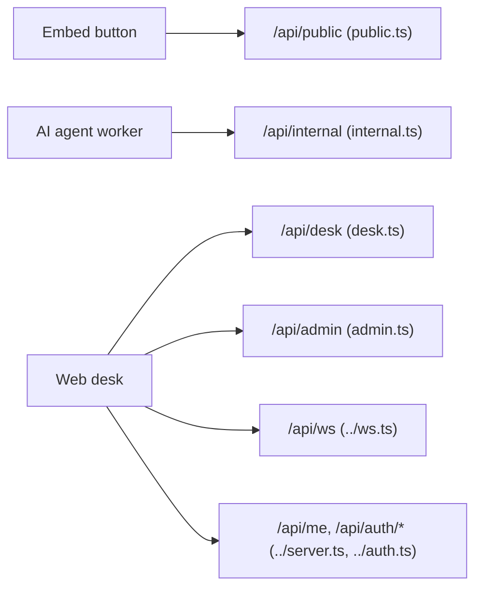

# Routes (`apps/api/src/routes`)

Each file is a Fastify plugin registered under a prefix in `server.ts` and receives its
dependencies as plugin options. Handlers are thin: check access, validate the body, call
a service or `Flow`, return JSON.

## Who calls what



## Access levels

| Level           | How it is checked                                                                | Failure                                |
| --------------- | -------------------------------------------------------------------------------- | -------------------------------------- |
| public          | embed key must exist; `Origin` must be in the key's allow-list (empty = any)     | 404 / 403                              |
| internal secret | `x-internal-secret` header equals `INTERNAL_API_SECRET` (plugin-wide preHandler) | 401 `unauthenticated`                  |
| member          | session cookie + a membership in the tenant (`x-tenant-id` or first membership)  | 401 `unauthenticated`, 403 `no_tenant` |
| supervisor      | member with role `supervisor`                                                    | 403 `forbidden`                        |
| admin email     | session + email listed in `ADMIN_EMAILS`                                         | 403 `forbidden`                        |

All error bodies are `{ error: '<code>' }`; `400 invalid_body` adds `issues` from zod.

## `public.ts` (prefix `/api/public`)

| Method | Path     | Auth   | Body                                                              | Response                           | Errors                                                                         |
| ------ | -------- | ------ | ----------------------------------------------------------------- | ---------------------------------- | ------------------------------------------------------------------------------ |
| POST   | `/calls` | public | `{ embedKey, queue? = 'support', language?, customerMeta? = {} }` | `{ callId, roomName, token, url }` | 400 `invalid_body`, 404 `unknown_embed_key_or_queue`, 403 `origin_not_allowed` |

Side effects: `call` row (`ringing` → `ai` or `waiting_human`), `customer` participant,
`call.created` event. In `ai-first` mode the token carries the agent dispatch; in
`human-first` mode `Flow.humanFirst` starts ringing.

## `internal.ts` (prefix `/api/internal`, all routes need the secret)

| Method | Path                      | Body                                                                   | Response                                                                    | Errors          |
| ------ | ------------------------- | ---------------------------------------------------------------------- | --------------------------------------------------------------------------- | --------------- |
| GET    | `/calls/:id`              | –                                                                      | call row                                                                    | 404 `not_found` |
| POST   | `/calls/:id/transcript`   | `TranscriptSegmentInput` (`speaker, identity, text, startMs?, endMs?`) | transcript row                                                              | 400, 404        |
| POST   | `/calls/:id/events`       | `{ type, payload? = {} }`                                              | `{ ok: true }`                                                              | 400, 404        |
| POST   | `/calls/:id/participants` | `{ kind: 'ai'\|'transcriber', identity, left? = false }`               | `{ ok: true }`                                                              | 400, 404        |
| POST   | `/calls/:id/escalate`     | `{ reason, summary, ringSec? = 20 (5..120) }`                          | `{ outcome: 'accepted', agentName }` or `{ outcome: 'nobody' }` (long-poll) | 400, 404        |
| POST   | `/calls/:id/status`       | `{ status: CallStatus, summary? }`                                     | updated call row                                                            | 400, 404        |

`transcript` emits `transcript` on the hub (pushed to subscribed desks); `status` emits
`call.updated`, and `status: 'ended'` goes through `Flow.end` (room deleted, ringing
stopped). `escalate` blocks until a human accepted or nobody could; the worker needs an
HTTP timeout longer than the whole ring cycle.

## Authorization

Every route names one **permission** (`Permission` in `@cc/shared`): `calls:read`,
`calls:answer`, `calls:supervise`, `tenant:read`, `tenant:write`, `api-keys:manage`. A
signed-in user has the permissions of their role in the selected tenant
(`ROLE_PERMISSIONS`: agents read and answer; supervisors everything), an **API key**
(`Authorization: Bearer ak_…`, managed under `/api/admin/api-keys`) exactly the set it was
created with, always in its own tenant. `authorize(permission)` in `server.ts` is the
only guard; the "Auth" columns below name the permission (`member` = `calls:read` /
`calls:answer`, `supervisor` = `calls:supervise` or `tenant:write`).

## `desk.ts` (prefix `/api/desk`)

| Method | Path                    | Auth       | Body                                             | Response                                | Errors                                      |
| ------ | ----------------------- | ---------- | ------------------------------------------------ | --------------------------------------- | ------------------------------------------- |
| GET    | `/settings`             | member     | –                                                | `{ notReadyReasons, acwSec }`           | 401, 403                                    |
| GET    | `/agents`               | member     | –                                                | `AgentPresence[]` (who is online)       | 401, 403                                    |
| POST   | `/state`                | member     | `{ state: 'ready' \| 'not_ready', reason? }`     | my `AgentPresence`                      | 400, 409 `offline` / `on_call`              |
| POST   | `/acw/extend`           | member     | –                                                | my `AgentPresence`                      | 409 `not_in_acw`                            |
| POST   | `/acw/done`             | member     | –                                                | my `AgentPresence`                      | 409 `not_in_acw`                            |
| POST   | `/agents/:userId/state` | supervisor | `AgentStateRequest` or `{ state: 'logged_out' }` | presence or `{ ok: true }`              | 400, 404, 409 `on_call`                     |
| GET    | `/calls`                | member     | –                                                | latest 50 calls with `queueKey`         | 401, 403                                    |
| GET    | `/calls/:id`            | member     | –                                                | call + participants, transcript, events | 404 `not_found`                             |
| POST   | `/calls/:id/accept`     | member     | –                                                | `{ token, url }`                        | 404, 409 `not_ringing_you`, 409 `call_over` |
| POST   | `/calls/:id/decline`    | member     | –                                                | `{ ok: true }`                          | 401, 403                                    |
| POST   | `/calls/:id/join`       | supervisor | `{ mode: 'listen' \| 'takeover' }`               | `{ token, url }`                        | 400, 404, 409 `call_over`                   |
| POST   | `/calls/:id/leave`      | member     | `{ role? = 'human' \| 'supervisor' }`            | `{ ok: true }`                          | 400, 404                                    |

`accept` is gated by `Routing.accept`: only the agent currently being rung for that call
succeeds. `leave` with `role: 'human'` ends the call and puts the agent into wrap-up.
`/agents/:userId/state` with `logged_out` closes the agent's desk sockets (they get a
`logout` frame first).

## `admin.ts` (prefix `/api/admin`)

| Method | Path                  | Auth            | Body                                             | Response                                                                | Errors        |
| ------ | --------------------- | --------------- | ------------------------------------------------ | ----------------------------------------------------------------------- | ------------- |
| POST   | `/tenants`            | admin email     | `{ name }`                                       | tenant row                                                              | 400, 403      |
| GET    | `/tenant`             | supervisor      | –                                                | tenant row with parsed settings                                         | 401, 403      |
| PATCH  | `/tenant/settings`    | supervisor      | partial `TenantSettings`                         | `{ settings }`                                                          | 400, 403      |
| GET    | `/members`            | supervisor      | –                                                | `[{ userId, name, email, role }]`                                       | 403           |
| GET    | `/invites`            | supervisor      | –                                                | invite rows                                                             | 403           |
| POST   | `/invites`            | supervisor      | `{ email, role: 'agent' \| 'supervisor' }`       | invite row                                                              | 400, 403      |
| GET    | `/queues`             | supervisor      | –                                                | queue rows with `memberIds`                                             | 403           |
| POST   | `/queues`             | supervisor      | `{ key, name }` (key is slugified)               | queue row                                                               | 400, 403      |
| PUT    | `/queues/:id/members` | supervisor      | `{ userIds: string[] }`                          | `{ ok: true }`                                                          | 400, 403, 404 |
| GET    | `/embed-keys`         | supervisor      | –                                                | embed key rows                                                          | 403           |
| POST   | `/embed-keys`         | supervisor      | `{ label, allowedOrigins? = [] }` (full origins) | embed key row (`publicKey`)                                             | 400, 403      |
| GET    | `/api-keys`           | tenant:read     | –                                                | `[{ id, name, prefix, permissions, createdAt, lastUsedAt, revokedAt }]` | 403           |
| POST   | `/api-keys`           | api-keys:manage | `{ name, permissions: Permission[] }`            | key row + `secret` (shown once)                                         | 400, 403      |
| DELETE | `/api-keys/:id`       | api-keys:manage | –                                                | `{ ok: true }`                                                          | 404           |
| DELETE | `/embed-keys/:id`     | supervisor      | –                                                | `{ ok: true }`                                                          | 403, 404      |

## Top-level routes (in `server.ts` / `auth.ts`)

| Method   | Path          | Auth    | Response                                           |
| -------- | ------------- | ------- | -------------------------------------------------- |
| GET      | `/api/health` | none    | `{ ok: true }`                                     |
| GET      | `/api/me`     | session | `{ user, isAdmin, memberships }`                   |
| GET/POST | `/api/auth/*` | –       | Better Auth (sign-in, callback, session, sign-out) |
| GET      | `/embed/*`    | none    | Built call button, when `apps/embed/dist` exists   |

## The `parseBody` convention

```ts
const body = parseBody(Schema, request.body, reply);
if (!body) return undefined;
```

`parseBody` (`util.ts`) runs `schema.safeParse`; on failure it sends
`400 { error: 'invalid_body', issues }` and returns `undefined`. Returning `undefined`
from the handler tells Fastify the reply was already sent. For routes whose body may be
empty pass `request.body ?? {}` so defaults apply.

Schemas shared with other apps (`TranscriptSegmentInput`, `CallStatus`, `TenantSettings`,
`MembershipRole`) come from `@cc/shared`; route-specific ones are defined inline.
