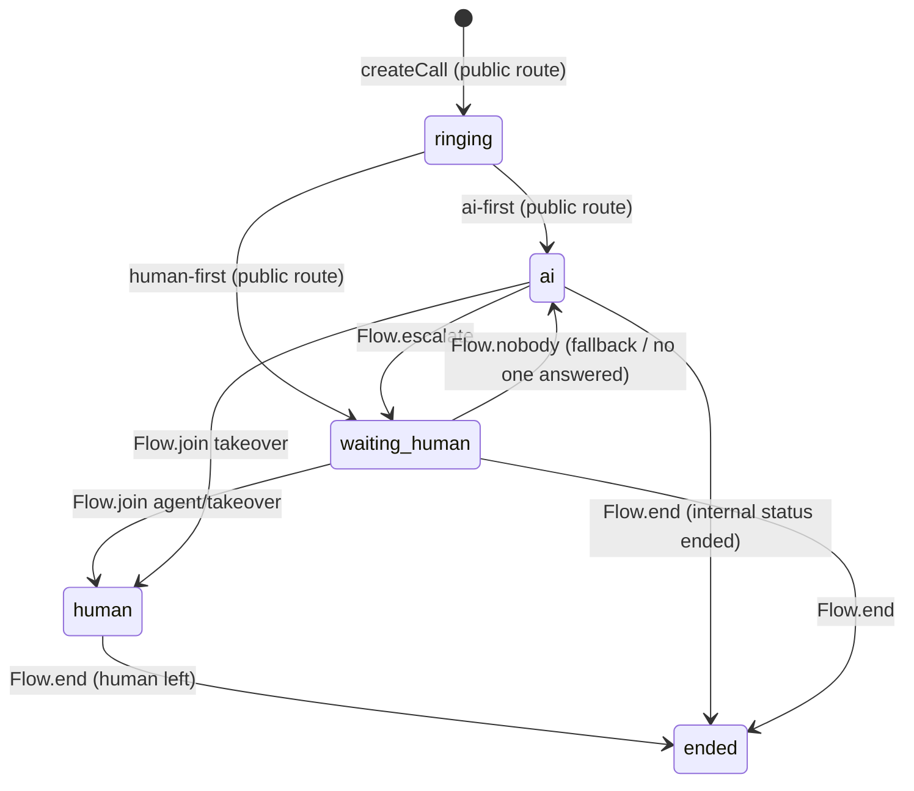

# Services (`apps/api/src/services`)

Plain async functions over the Drizzle client. They know nothing about Fastify, LiveKit
or the event hub; routes and `Flow` compose them. Every tenant-facing function takes the
`tenantId` and filters by it, so rows of other tenants are unreachable even with a
guessed id.

## `tenants.ts`

### `bootstrapUser(db, user, adminEmails)`

Runs once per new user, from Better Auth's `user.create.after` hook or from `devAuth`.

1. Every open invite (`acceptedAt IS NULL`) for the lower-cased email becomes a
   membership with the invited role, and the invite is marked accepted.
   `onConflictDoNothing` on the `(userId, tenantId)` unique index makes this idempotent.
2. If the user still has no membership and the email is in `ADMIN_EMAILS` (trimmed,
   case-insensitive), `createTenant` gives them `"<name>'s contact center"` with
   themselves as supervisor.

Running it again for the same user is a no-op.

### `createTenant(db, name, userId)`

Inserts the tenant with `defaultTenantSettings()` and slug
`slugify(name) + '-' + id.slice(0, 6)`, a default queue `support` / "Support", and a
`supervisor` membership for `userId`. Used by `POST /api/admin/tenants` and the bootstrap.

### Embed key resolution

- `createEmbedKey` generates `publicKey = 'pk_' + 32 hex chars`; it is public by design
  (it sits in third-party HTML).
- `resolveEmbedKey(db, publicKey, queueKey)` returns `{ key, queue, tenant }` (tenant
  settings parsed with zod) or `undefined` when the key or the queue is unknown.
- `originAllowed(allowed, origin)`: an empty allow-list allows any origin; otherwise the
  raw `Origin` header must match an entry exactly (`https://example.com`, no path).

### `slugify(name)`

Lower-case, non-alphanumeric runs → `-`, trimmed, `'tenant'` when empty. Used for tenant
slugs and queue keys (`"VIP Sales"` → `vip-sales`).

### Others

| Function                                                          | Notes                                                                                                            |
| ----------------------------------------------------------------- | ---------------------------------------------------------------------------------------------------------------- |
| `membershipsOf(db, userId)`                                       | Tenants + role + name + slug; used by `authenticate`, `/api/me`, the websocket                                   |
| `getTenant` / `updateSettings`                                    | Settings are parsed through `TenantSettings` on read; `updateSettings` shallow-merges the patch and re-validates |
| `listMembers`                                                     | Users joined with their role                                                                                     |
| `createInvite` / `listInvites`                                    | One invite per (tenant, email); re-inviting updates the role and re-opens it                                     |
| `listQueues` / `createQueue` / `setQueueMembers` / `queuesOfUser` | `setQueueMembers` replaces the whole list; desks read queues at connect time                                     |
| `listEmbedKeys` / `deleteEmbedKey`                                | Tenant-scoped                                                                                                    |

## `mediaAssets.ts`

Uploaded sound files (hold music, desk ringtone, embed ringback) stored as `bytea` in
`media_asset`; what a tenant stores in `TenantSettings.sounds` is the public path
`mediaUrl(id)` = `/api/public/media/<id>`.

| Function                                                   | Notes                                                                                               |
| ---------------------------------------------------------- | --------------------------------------------------------------------------------------------------- |
| `MAX_ASSET_BYTES` / `ALLOWED_MIME`                         | 5 MiB per file; `audio/wav` (+ `x-wav`, `wave`), `mpeg`, `mp3`, `ogg`, `webm`, `aac`, `mp4`, `flac` |
| `isWav(bytes)`                                             | `RIFF….WAVE` sniff; the upload route requires it for WAV mime types                                 |
| `createMediaAsset(db, tenantId, { name, mimeType, data })` | Returns the `MediaAsset` DTO (`url` included, never the bytes)                                      |
| `listMediaAssets(db, tenantId)`                            | Newest first, never selects `data`                                                                  |
| `deleteMediaAsset(db, tenantId, id)`                       | Tenant-scoped; `false` when there is no such file                                                   |
| `readMediaAsset(db, id)`                                   | Bytes + mime type for `GET /api/public/media/:id`; not tenant-scoped (random ids, public sounds)    |

## `calls.ts`

Writers and readers for `call`, `call_participant`, `transcript_segment` and `call_event`.
There is no transition validation in this module: the callers own the state machine.

### Call status

Who writes what:

| Transition                         | Writer                                                                   |
| ---------------------------------- | ------------------------------------------------------------------------ |
| `ringing` (insert)                 | `createCall` from `routes/public.ts`                                     |
| `ringing → ai` / `→ waiting_human` | `routes/public.ts` right after minting the customer token                |
| `→ waiting_human`                  | `Flow.escalate`                                                          |
| `→ human`                          | `Flow.join` (modes `agent`, `takeover`)                                  |
| `→ ai`                             | `Flow.nobody` (escalation failed or human-first fallback)                |
| `→ ended`                          | `Flow.end` (human left, or AI posted `status: 'ended'`)                  |
| any status                         | `POST /api/internal/calls/:id/status` writes non-`ended` values directly |

`setCallStatus` also stamps `endedAt` for `ended`. `Flow.status()` is the only path that
emits `call.updated`; the internal status route emits it itself.

### Participants

`addParticipant({ callId, kind, identity, userId? })` records a join; `markParticipantLeft`
stamps `leftAt` on the open row with that identity. Kinds: `customer`, `ai`, `human`,
`supervisor`, `transcriber`. Identities are `<role>:<id>` (`customer:<callId>`,
`ai:<callId>`, `human:<userId>`, `supervisor:<userId>`).

### Transcript segments

`addTranscript(callId, segment)` stores one utterance from the AI worker (`speaker`,
`identity`, `text`, optional `startMs` / `endMs`). The live copy goes to desks through the
hub; this is the persistent copy shown in call detail.

### Events

`addEvent(callId, type, payload?)` is an append-only timeline. Types written by the API:
`call.created`, `escalation.requested`, `offer.accepted`, `offer.nobody`,
`agent.joined`, `takeover.joined`, `listen.joined`, `human.left`, `supervisor.left`. The AI
worker adds its own through `POST /api/internal/calls/:id/events`.

### Reads

- `listCalls(db, tenantId, limit = 50)`: newest first, joined with the queue key; the desk
  call list.
- `callDetail(db, tenantId, id)`: the call plus participants (left-joined with `user`, so
  each carries `name: string | null`), transcript (by `createdAt`)
  and events (by `at`); `undefined` when the call belongs to another tenant. Desk routes
  use it both as the detail view and as the tenant check before `accept` / `join` / `leave`.
- `getCall(db, id)` is **not** tenant-scoped; it is for internal routes and `Flow`.
