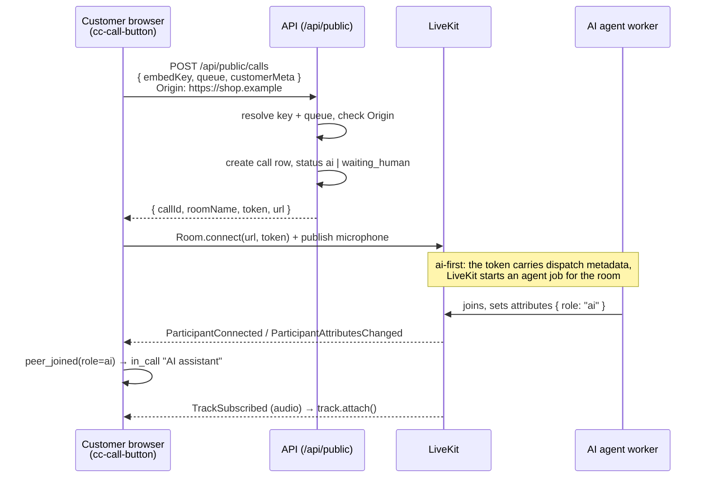
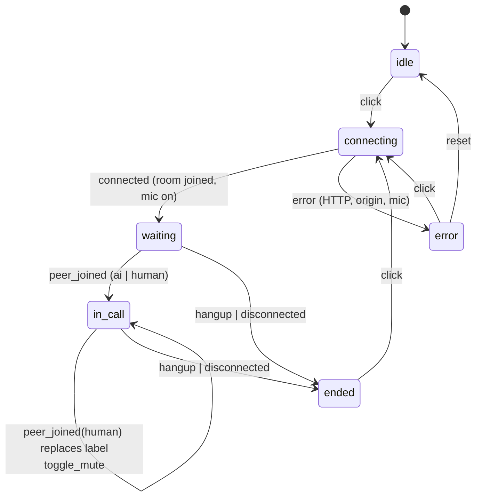

# Call button (`apps/embed`)

`<cc-call-button>` is a web component that a tenant pastes into any website. One click
starts a WebRTC voice call into the contact center: the customer talks to the AI agent
and, if the AI escalates or the tenant is human-first, to a human agent at the desk.

It is framework-free (a custom element with a shadow root), depends only on
`livekit-client`, and ships as a single IIFE script served by the API.

## Embedding

```html
<script src="https://API_ORIGIN/embed/call-button.js"></script>
<cc-call-button
  key="pk_…"
  queue="support"
  api="https://API_ORIGIN"
  label="Call us"
></cc-call-button>
```

Supervisors get this exact snippet, with their key filled in, from the **Settings →
Call button for your website** card of the desk. `API_ORIGIN` is wherever `apps/api`
is reachable (`http://localhost:4000` in development).

### Attributes

| Attribute | Required | Default                     | Meaning                                                                                |
| --------- | -------- | --------------------------- | -------------------------------------------------------------------------------------- |
| `key`     | yes      | —                           | Public embed key (`pk_…`) created in the supervisor settings.                          |
| `queue`   | no       | `support`                   | Key of the queue to ring. Must exist in the tenant.                                    |
| `api`     | no       | origin the script came from | Origin of the API, without path. Only needed when the script is self-hosted elsewhere. |
| `label`   | no       | `Call us`                   | Text of the button in the idle state.                                                  |

Attributes are read when they are needed (on click / render), so they can be set from
script after the element exists; the demo page does exactly that.

## How a call starts



Which peer the customer is talking to is derived from the `role` attribute of remote
participants (`ai`, `human`, `supervisor`, `transcriber`; see `ParticipantAttributes`
in `packages/shared`). The API bakes the role into desk tokens; the AI sets its own
after joining, which is why attribute changes are treated like joins.

One subtlety worth knowing: in ai-first mode the AI is often already in the room by the
time `Room.connect` resolves, so no `ParticipantConnected` event fires for it, and any
event that fired before the `connected` state was ignored by the reducer. After
connecting, `call-button.ts` therefore re-announces every participant already present
(`room.remoteParticipants.forEach(onPeer)`).

## State machine

`src/state.ts` is a pure reducer; the element dispatches events into it and re-renders
from the result.



Rules encoded in the reducer (and checked in `state.test.ts`):

- `peer_joined` with any other role (`transcriber`, another `customer`) is ignored.
- A human joining while the AI is on the call switches the label to `Agent <name>`;
  the AI (re)joining afterwards does not switch it back.
- `peer_left` changes nothing: the room's `Disconnected` event ends the call. The API
  deletes the room when a human agent hangs up, which is what disconnects the customer.
- `hangup` / `disconnected` never overwrite an `error`, so cleanup after a failure keeps
  the message on screen.

What the customer sees under the button comes from `statusText(state, now)`:
`Connecting…`, `Please hold, connecting you…`, `AI assistant · 1:05`, `Call ended. Thanks
for calling!`, or `Could not start the call: …`.

## Audio

The element enables the local microphone right after `Room.connect`
(`localParticipant.setMicrophoneEnabled(true)`), which is what triggers the browser's
permission prompt. For playback it listens to `RoomEvent.TrackSubscribed` and, for every
audio track, appends `track.attach()` (an `<audio autoplay>` element) into a hidden
`<div>` inside the shadow root. Elements are removed again on hang-up. Because playback
starts from a user click, autoplay policies are satisfied.

Mute toggles `setMicrophoneEnabled` on the local participant; it never unsubscribes
remote audio.

## Security model

- The embed key is **public** by design (it is in the page source of the customer's
  website). It identifies the tenant and unlocks nothing else.
- Abuse is limited by the key's **allowed origins**: the API compares the request's
  `Origin` header with the list stored for the key (`originAllowed` in
  `apps/api/src/services/tenants.ts`). An empty list allows any origin, which is handy
  in development and a bad idea in production. `Origin` is set by the browser and cannot
  be changed from page script, but it offers no protection against non-browser clients.
- The customer is **not authenticated**. The LiveKit token the API returns is scoped to
  that one room with the identity `customer:<callId>` and the `customer` role.
- `customerMeta` (`page`, `userAgent`) is forwarded to the AI and shown on the
  dashboard; do not put anything sensitive there.

## Build output

```bash
npm run build -w apps/embed     # → apps/embed/dist/call-button.js
```

`vite.config.ts` uses library mode with `formats: ['iife']`, so the output is one
self-contained script (global `CcCallButton`) that registers the element on load and
needs no bundler on the host page. `livekit-client` is bundled in, which makes the file
about 500 KB minified (roughly 125 KB gzipped); acceptable for a POC, but a real
deployment would want a long cache header or a CDN in front of it. The API serves the
`dist/` folder at `/embed/` when it exists (`apps/api/src/server.ts`), so the desk's
snippet works as soon as the embed has been built.

## Demo page

`index.html` is a stand-in for "any website". `npm run dev:embed` serves it on
`http://localhost:3001` with the element loaded from source (hot reload). Query
parameters override the attributes for quick testing:

```
http://localhost:3001/?key=pk_…&api=http://localhost:4000&queue=support
```

The defaults point at `http://localhost:4000`; the API must be running, and the AI
worker (`npm run dev:agent`) if you want someone to answer.

## Testing

- **Unit**: `src/state.test.ts` (Vitest) walks the machine through a normal AI call with
  a human take-over, ignored events, errors and text formatting. Run `npm run test:unit`
  at the root. The element itself has no unit tests; keep decisions in `state.ts`.
- **End-to-end**: `tests/e2e/handoff.spec.ts` creates an embed key in the desk, opens
  the demo page with it, clicks **Call us**, waits for `AI assistant` to appear and
  checks the desk shows the call. It is skipped without `LIVEKIT_API_KEY` because it
  needs LiveKit Cloud and the agent worker.
