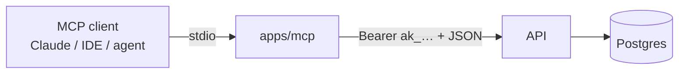

# MCP server (`apps/mcp`)

A thin [Model Context Protocol](https://modelcontextprotocol.io) server over the
Patchbay Contact Center API: **tools = routes**. At startup it fetches
`GET /api/openapi.json` from the running API and turns every permission-gated
operation (desk and admin) into one MCP tool — `get_desk_calls`,
`get_desk_calls_id`, `post_desk_messages`, `get_desk_stats`,
`put_admin_tenant_settings`, … — so an LLM or IDE can read stored conversations,
watch live statistics, message the team or reconfigure routing with the same
surface and permissions as any other API client.



## Running

1. Create an API key on the desk: **Settings → API keys** (its permissions bound
   what the tools may do; calls beyond them answer 403).
2. Configure and start:

```sh
MCP_API_URL=http://localhost:4000   # default
MCP_API_KEY=ak_...                  # required
npm run -w apps/mcp start
```

Register it in an MCP client as a stdio server with that command, e.g. for the
Claude CLI: `claude mcp add contact-center -e MCP_API_KEY=ak_... -- npm run -w apps/mcp start`.

## Design

- `server.ts` — pure: `buildTools(spec)` (OpenAPI → tool list with a flat input
  schema: path parameters + body properties) and `callTool` (substitute params,
  send the rest as the JSON body, `Authorization: Bearer` the key). Unit-tested.
- `index.ts` — thin wiring: fetch the spec, serve `tools/list` and `tools/call`
  over stdio with `@modelcontextprotocol/sdk`.
- The tool list is identical for every key; authorization stays server-side in
  the API (`x-permission` per route), so there is exactly one permission model.
