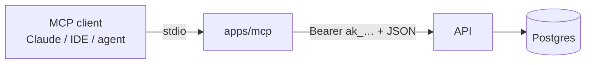

# MCP server (`apps/mcp`)

A thin [Model Context Protocol](https://modelcontextprotocol.io) server over the
Patchbay Contact Center API: **tools = routes**. At startup it fetches
`GET /api/openapi.json` from the running API and turns every permission-gated
operation (desk and admin) into one MCP tool — `get_desk_calls`,
`get_desk_calls_id`, `post_desk_messages`, `get_desk_stats`,
`put_admin_tenant_settings`, … — so an LLM or IDE can read stored conversations,
watch live statistics, message the team or reconfigure routing with the same
surface and permissions as any other API client.


```mermaid
flowchart LR
  C[MCP client\nClaude / IDE / agent] -- stdio --> M[apps/mcp]
  M -- "Bearer ak_… + JSON" --> A[API]
  A --> P[(Postgres)]
```

## Running

1. Create an API key on the desk: **Settings → API keys** (its permissions bound
   what the tools may do; calls beyond them answer 403), or with the Node script below.
2. Configure and start:

```sh
MCP_API_URL=http://localhost:4000   # default
MCP_API_KEY=ak_...                  # required
npm run -w apps/mcp start
```

Register it in an MCP client as a stdio server, e.g. for the
Claude CLI, from the repo root: `claude mcp add contact-center -e MCP_API_KEY=ak_... -- node "$PWD/apps/mcp/src/index.ts"`.
Use `node` rather than `npm run` there: npm prints a banner on stdout, the protocol channel.
Only documented GET/POST/PUT/PATCH/DELETE operations become tools; the API leaves
Fastify's implicit HEAD routes out of the OpenAPI document.

### Creating the key from Node.js

The key cannot be generated locally: the API creates it, stores only a hash and returns
the secret once (`POST /api/admin/api-keys`). [`scripts/create-api-key.mjs`](scripts/create-api-key.mjs)
calls that route with plain `fetch` (no dependencies) and takes its settings as arguments
instead of environment variables, so the same command works in bash, zsh, PowerShell and
`cmd`. From the repository root, with the API running:

```sh
node apps/mcp/scripts/create-api-key.mjs                   # dev API on :4000, name "Claude MCP"
node apps/mcp/scripts/create-api-key.mjs http://localhost:4100 "Claude MCP"
node apps/mcp/scripts/create-api-key.mjs https://api.example.com "Claude MCP" ak_<admin key>
npm run -w apps/mcp create-key -- http://localhost:4000 "Claude MCP"   # same, via npm
```

It prints `MCP_API_KEY=ak_…` once; copy it into the `claude mcp add` command.

- **Dev** (`DEV_USER_EMAIL` set, you in `ADMIN_EMAILS`): no credentials needed; the dev
  user is the supervisor who owns the key.
- **Otherwise** pass an existing key that has `api-keys:manage` as the third argument
  (create the first one on the desk). A wrong key fails with `401 unauthenticated`, a key
  without that permission with `403 forbidden`; an API that is not running gives
  `Cannot reach the API at …`.
- Permissions: `calls:read`, `calls:answer`, `calls:supervise`, `tenant:read`,
  `tenant:write`, `api-keys:manage`. Give the MCP client only what it needs; the script
  leaves out the write and key-management ones (edit its `permissions` list to change that).

## Design

- `server.ts` — pure: `buildTools(spec)` (OpenAPI → tool list with a flat input
  schema: path parameters + body properties) and `callTool` (substitute params,
  send the rest as the JSON body, `Authorization: Bearer` the key). Unit-tested.
- `index.ts` — thin wiring: fetch the spec, serve `tools/list` and `tools/call`
  over stdio with `@modelcontextprotocol/sdk`.
- The tool list is identical for every key; authorization stays server-side in
  the API (`x-permission` per route), so there is exactly one permission model.
