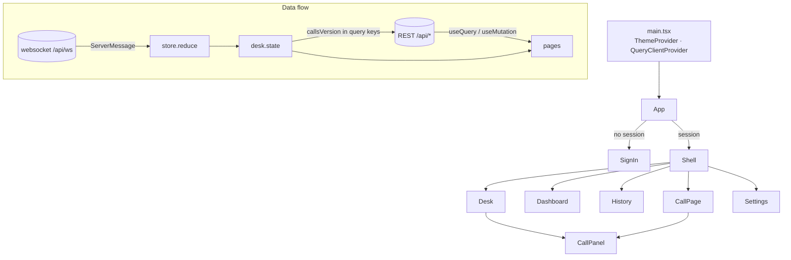
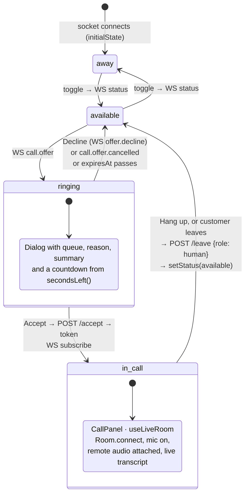

# Agent desk (`apps/web`)

The browser app that human agents and supervisors use: go available, get rung, talk to
customers, watch live calls, read transcripts and configure the tenant. It is a plain
Vite + React 19 single-page app with MUI 9 for UI, TanStack Query for REST data and a
websocket for everything that happens in real time.

It talks to `apps/api` only. LiveKit media goes straight from the browser to the LiveKit
server using tokens the API hands out.

## Running it

```bash
npm run dev:web          # Vite dev server on http://localhost:3000
```

| Variable   | Default | Meaning                                                                    |
| ---------- | ------- | -------------------------------------------------------------------------- |
| `WEB_PORT` | `3000`  | Port of the Vite dev server.                                               |
| `API_PORT` | `4000`  | Where `/api` (REST **and** websocket) is proxied to, see `vite.config.ts`. |

The proxy keeps every request same-origin so the Better Auth session cookie is
first-party and no CORS setup is needed in development. The API must be running
(`npm run dev:api`); the AI agent worker is only needed to actually take calls.

`npm run build -w apps/web` produces a static `dist/` that can be served by any web
server that forwards `/api` to the API.

### Signing in

Sign-in is Better Auth with Google as the only provider. The button calls
`authClient.signIn.social({ provider: 'google' })`, the API completes the OAuth dance
and sets the session cookie. A user then needs a **membership** in a tenant (created by
a supervisor invite, matched on the Google email) to see anything.

For local work set `DEV_USER_EMAIL=you@example.com` in the API's environment
(non-production only). The API then answers `/api/auth/get-session` with that user,
bootstraps a tenant for them and no Google round-trip happens. The Playwright tests rely
on this.

## Structure

```
src/
  main.tsx              providers (MUI theme, QueryClient) and mount
  App.tsx               session gate → SignIn | Shell (tabs, tenant selector, desk socket)
  pages/
    Desk.tsx            #/desk        availability, offer dialog, active call
    Dashboard.tsx       #/dashboard   live calls + presence (supervisors)
    History.tsx         #/history     all calls of the tenant
    CallPage.tsx        #/calls/<id>  transcript, events, listen-in / take-over
    Settings.tsx        #/settings    routing, team, queues, embed keys (supervisors)
  components/
    CallPanel.tsx       in-call view + Transcript list
  lib/
    api.ts              fetch wrapper, auth client, DTO types
    store.ts            pure reducer for websocket messages + helpers (unit-tested)
    hooks.ts            useDeskSocket, useLiveRoom, useRoute, useNow
```



Two things are worth knowing up front:

- **There is no router.** `location.hash` is parsed by `parseRoute` in `lib/store.ts`
  and `useRoute` re-renders on `hashchange`. Navigate by assigning `location.hash`.
- **There is no global store library.** `useDeskSocket` (called once in `Shell`) owns a
  `useReducer` over `store.reduce`; its return value is passed to pages as the `desk`
  prop. REST data lives in TanStack Query.

## Pages

| Route          | Who         | Shows                                                                                         | Endpoints / messages                                                                                                              |
| -------------- | ----------- | --------------------------------------------------------------------------------------------- | --------------------------------------------------------------------------------------------------------------------------------- |
| `#/desk`       | everyone    | `StateBar` (Ready / Not ready + reason, timer, wrap-up), incoming-call dialog, `CallPanel`    | `POST /desk/state`, `/desk/acw/*`, `GET /desk/settings`; WS `offer.decline`, `subscribe`; `POST /desk/calls/:id/accept`, `/leave` |
| `#/dashboard`  | supervisors | Live calls with duration + status chip, agents with state, reason and timer, force-state menu | `GET /desk/calls`, `POST /desk/agents/:userId/state`; WS `presence`, `call.updated`                                               |
| `#/history`    | everyone    | Table of all calls (started, queue, status, duration, summary)                                | `GET /desk/calls`; WS `call.updated` (re-fetch)                                                                                   |
| `#/calls/<id>` | everyone    | Transcript, AI summary, event log; supervisors: listen in / take over                         | `GET /desk/calls/:id`; WS `subscribe`, `transcript`; `POST /desk/calls/:id/join` (`listen`/`takeover`), `/leave`                  |
| `#/settings`   | supervisors | Routing & AI, team & invites, queues, embed keys                                              | `GET/PATCH /admin/tenant…`, `GET/POST /admin/members`, `/admin/invites`, `/admin/queues…`, `/admin/embed-keys…`                   |

All REST paths are relative to `/api`; the `api()` helper adds the prefix, the session
cookie and the `x-tenant-id` header. The websocket is `/api/ws?tenantId=…`. Message
shapes (`ServerMessage`, `ClientMessage`) are zod schemas in `packages/shared`.

## The agent's day: desk state machine



Notes for the curious:

- The server routes offers one agent at a time; `expiresAt` is when it moves on. The
  countdown is purely cosmetic, the reducer keeps the offer until a
  `call.offer.cancelled` or an `ended` `call.updated` arrives, or the user acts.
- The agent's own state is never set optimistically: the `StateBar` posts to
  `/api/desk/state` and shows whatever the next `presence` frame says (`myPresence`
  in `store.ts`). The server sets `busy` on accept and `acw` after hang-up.
- `CallPanel` calls `onLeave` on its own when no peer with `role: customer` is left in
  the room, so an agent is never stuck in an empty room.
- After a reconnect of the websocket the API sees a new connection, i.e. the agent is
  `not_ready` again — and, since the state comes from the server, the desk shows that.
- A `logout` frame (supervisor forced it) stops the reconnect loop and shows a banner.

## Supervisors: listen in and take over

On a live call's page (`#/calls/<id>`) a supervisor gets two buttons. Both call
`POST /api/desk/calls/:id/join` with a `mode` and render the same `CallPanel` with the
returned token:

| Mode       | `publish` | Role sent on leave | Effect                                                                                       |
| ---------- | --------- | ------------------ | -------------------------------------------------------------------------------------------- |
| `listen`   | `false`   | `supervisor`       | Joins silently (no microphone). Leaving does not affect the call.                            |
| `takeover` | `true`    | `human`            | Joins as a human agent; the AI applies the tenant's handoff behavior. Leaving ends the call. |

## `lib/` in more detail

**`api.ts`** — `authClient` (Better Auth React client, base path `/api/auth`), the DTO
types the pages consume (`Me`, `CallSummary`, `CallDetail`, `Tenant`, `Queue`,
`Member`, `Invite`, `EmbedKey`) and the `api` / `post` / `patch` / `put` / `del`
helpers. `setTenant` stores the tenant id used for the `x-tenant-id` header; `Shell`
calls it whenever the selected membership changes. Non-2xx responses throw an
`ApiError` whose message is the API's `error` code (`not_ringing_you`, `call_over`…).

**`store.ts`** — `reduce(state, action)` and `initialState`. Actions are either local
(`socket`, `myStatus`, `offer.clear`) or `{ type: 'server', message }` wrapping a
`ServerMessage`. The reducer keeps: connection flag, own status, current offer, presence
list, latest status per call, live transcript segments per call and `callsVersion`,
a counter bumped on every `call.updated`. Helpers: `secondsLeft`, `formatDuration`,
`statusLabel` / `statusColor`, `parseRoute`. Everything here is pure and covered by
`store.test.ts`.

**`hooks.ts`**

- `useDeskSocket(tenantId)` opens the websocket, feeds every frame to the reducer and
  reconnects two seconds after any close until unmounted. Returns
  `{ state, dispatch, send, setStatus }`. `send` silently drops messages while the
  socket is not open.
- `useLiveRoom(join)` wraps a `livekit-client` `Room`: connects with `join.token`,
  enables the microphone when `join.publish`, attaches every subscribed audio track into
  the element referenced by `audioRef`, tracks remote peers (identity, name, `role`
  attribute) and exposes `toggleMute`. Disconnects on unmount or when `join` changes.
- `useRoute()` and `useNow()` are the tiny helpers described above.

## Conventions

- **Styling**: MUI components with the `sx` prop. No CSS files, no styled-components
  beyond what MUI brings.
- **Routing**: hash routes only; add cases to `Route` / `parseRoute` rather than a
  router dependency.
- **Server data**: `useQuery` with array keys. Lists that must refresh when a call
  changes include `desk.state.callsVersion` in their key
  (`['calls', callsVersion]`, `['call', id, callsVersion]`), so a `call.updated`
  websocket frame is all it takes to re-fetch. Mutations call
  `queryClient.invalidateQueries` on success.
- **Real-time data**: never read the websocket directly in a page; extend `DeskState`
  and `reduce` and add a unit test.
- **Props over context**: pages receive `desk` (and `me` / `supervisor` where needed)
  from `Shell`.
- **Formatting/linting**: root `npm run format` and `npm run lint`; imports are sorted
  by the prettier plugin.

## Adding a page

1. Add a variant to `Route` and a case to `parseRoute` in `lib/store.ts`; extend the
   `parses hash routes` test in `store.test.ts`.
2. Create `src/pages/MyPage.tsx` exporting a component that takes `desk` (and anything
   else it needs) as props. Fetch with `useQuery`, include `callsVersion` in the key if
   the data changes with calls.
3. Render it in `Shell` (`App.tsx`) behind `route.page === 'mypage'`, gated by
   `supervisor` if needed, and add a `<Tab value="mypage" />`. Map the route to a tab
   value if it is a sub-page (see how `call` maps to `history`).
4. If it needs new server data, add the DTO type to `lib/api.ts` next to the endpoint
   it mirrors.
5. Run `npm run typecheck`, `npm run lint`, `npm run test:unit` and, ideally, add a
   Playwright scenario.

## Testing

- **Unit**: `src/lib/store.test.ts` (Vitest, jsdom) covers the reducer, countdown,
  duration formatting and route parsing. Run with `npm run test:unit` from the root.
  Components and hooks are not unit-tested; keep logic in `store.ts` where it is cheap
  to test.
- **End-to-end**: `tests/e2e/desk.spec.ts` (Playwright) signs in through
  `DEV_USER_EMAIL`, toggles availability, checks the dashboard and creates an embed key
  in Settings. `tests/e2e/handoff.spec.ts` drives a real call through the embed button
  and needs LiveKit Cloud credentials. Run with `npm run test:e2e`.
