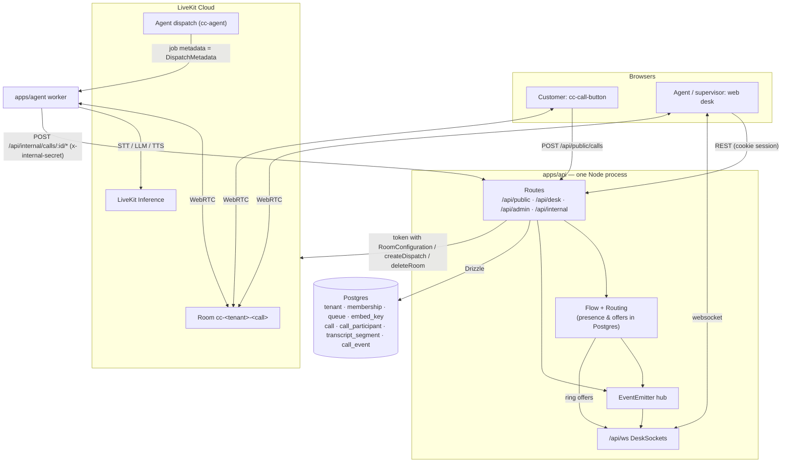
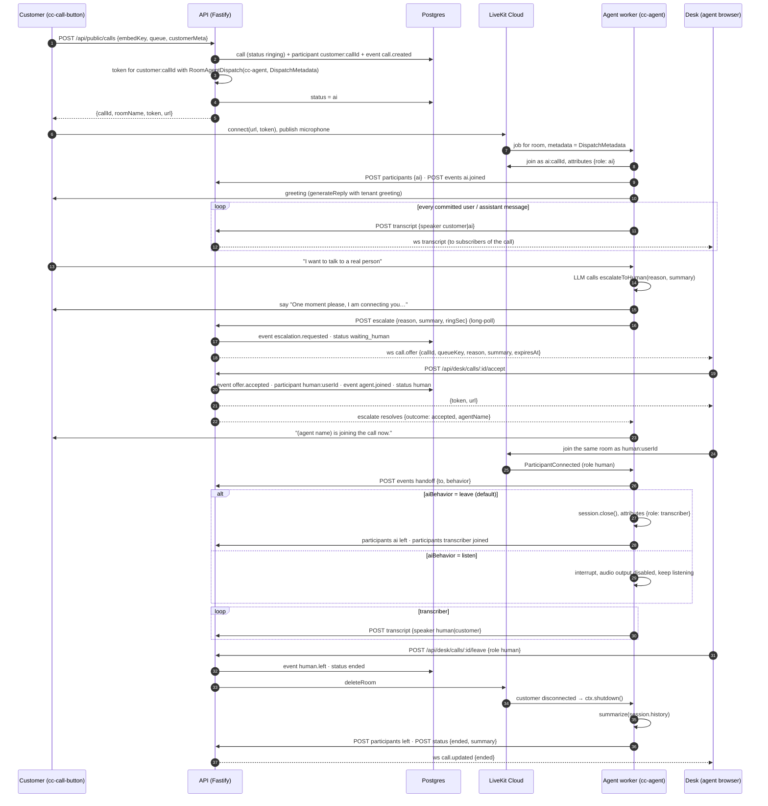
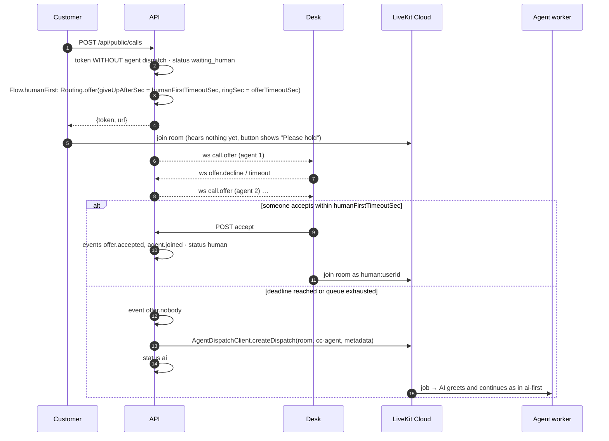

# Architecture

## Workspaces

The repo is an npm-workspaces monorepo (`packages/*`, `apps/*`). Node 24 runs the TypeScript sources directly with type stripping, so there is no build step for the API and the agent; imports use explicit `.ts` extensions and `tsc` only type-checks.

| Path              | Package      | What it is                                                                                                                                                                                                 |
| ----------------- | ------------ | ---------------------------------------------------------------------------------------------------------------------------------------------------------------------------------------------------------- |
| `packages/shared` | `@cc/shared` | zod schemas and inferred types shared by every app: `TenantSettings`, `CallStatus`, `ParticipantKind`, `DispatchMetadata`, websocket `ServerMessage` / `ClientMessage`, `roomNameFor`.                     |
| `packages/i18n`   | `@cc/i18n`   | The i18n runtime of the two UIs: supported languages (en, de, it), BCP 47 normalization, the desk's `cc_lng` cookie and the i18next instance factory; translations live next to each app in `src/locales`. |
| `apps/api`        | `@cc/api`    | Fastify 5 API: Better Auth (Google), Drizzle + Postgres, LiveKit tokens and agent dispatch, Postgres-backed routing, `/api/ws` desk websocket, serves the built embed script.                              |
| `apps/agent`      | `@cc/agent`  | LiveKit Agents worker registered as `cc-agent`. Voice pipeline on LiveKit Inference, `escalateToHuman` / `endCall` tools, post-handoff transcriber, LLM summary.                                           |
| `apps/web`        | `@cc/web`    | Vite + React 19 + MUI desk for agents and supervisors (Desk, Dashboard, History, Settings, call page). Hash routing, TanStack Query, one websocket per tenant.                                             |
| `apps/embed`      | `@cc/embed`  | `<cc-call-button>` web component built as a single IIFE `call-button.js`. Pure state reducer in `state.ts`, LiveKit client in `call-button.ts`.                                                            |

Supporting folders: `tests/` (Playwright e2e, Artillery load), `build/` (the LOC gate), `docs/` (this site plus the generated API reference), `apps/api/drizzle` (SQL migrations).

## System diagram

## End-to-end: `ai-first` call with escalation

Default tenant mode. The AI answers immediately; a human is rung only when the LLM calls `escalateToHuman`.

Notes:

- Step 3 is why the AI joins without an explicit dispatch call: the customer's token carries a `RoomConfiguration` with a `RoomAgentDispatch`, so LiveKit Cloud dispatches `cc-agent` when the room is created.
- `escalate` is a long-poll: the HTTP request stays open until a human accepted or nobody could, so the LLM tool returns the real outcome as the next sentence to say.
- The customer hanging up first ends with the same tail: the agent sees `ParticipantDisconnected` for `customer:callId`, shuts down and posts `status ended`, and `Flow.end` deletes the room.

## End-to-end: `human-first` call

Humans are rung first; the AI is a fallback.

## Key design decisions

**Same-room handoff.** The human agent joins the room the customer is already in; nobody is transferred, re-dialed or re-tokened. The customer's button just swaps its label from "AI assistant" to "Agent Name". This also lets the AI participant stay in the room after handoff as a transcriber (see below) and lets supervisors listen in or take over the very same room.

**Long-poll escalation.** `POST /api/internal/calls/:id/escalate` does not return until `Flow` resolves the waiter (`accepted` with the agent's name, or `nobody`). The agent's `escalateToHuman` tool therefore gets a concrete sentence to say back. The cost is an open HTTP request for up to the whole ring cycle, acceptable for the POC.

**Postgres-backed routing.** `Routing` (`apps/api/src/routing.ts`) keeps presence (`agent_presence`) and ringing offers (`ring_offer`) in Postgres, so a restart loses neither and several API instances share one engine: each runs the same periodic `tick()` and a `FOR UPDATE SKIP LOCKED` lock decides who advances an offer. Cross-instance delivery (an offer must reach a desk that may be on another instance) goes over a message bus (`bus.ts`): Postgres `LISTEN`/`NOTIFY` in production, an in-process emitter in tests. No Redis.

**zod contracts in `packages/shared`.** Tenant settings, call status, participant attributes, dispatch metadata and both websocket message unions are zod schemas; every boundary (`parseBody`, `ClientMessage.safeParse`, `DispatchMetadata.parse`) validates at runtime and the types are inferred once. The same file also owns `roomNameFor`.

**Dependency injection and fakes in tests.** `buildServer` takes `db`, `livekit`, and either a real `auth`, a `devUserEmail` or a `getSession` function. `LiveKit` is a four-method interface, so `apps/api/src/testing.ts` provides `fakeLiveKit()` that records tokens, dispatches and deletions. The agent's tools take an `AgentActions` object so evals can assert on `escalate` / `endCall` with `vi.fn()`.

**Dev auth bypass.** `DEV_USER_EMAIL` replaces Better Auth with a resolver that signs every request in as one user and answers the web client's `get-session` probe locally. `apps/api/src/index.ts` ignores it when `NODE_ENV=production`. Playwright and the load test rely on it.

**npm workspaces + type stripping.** No bundler for server code; `node src/index.ts` runs as-is. `tsconfig.base.json` sets `erasableSyntaxOnly` so enums, namespaces and parameter properties cannot sneak in.

**LOC budget.** `build/loc.mjs` fails `validate` above 50k non-blank tracked source lines and warns above 20k. The repo is meant to stay small enough for one person to hold in their head; see [Build scripts](/build/).
