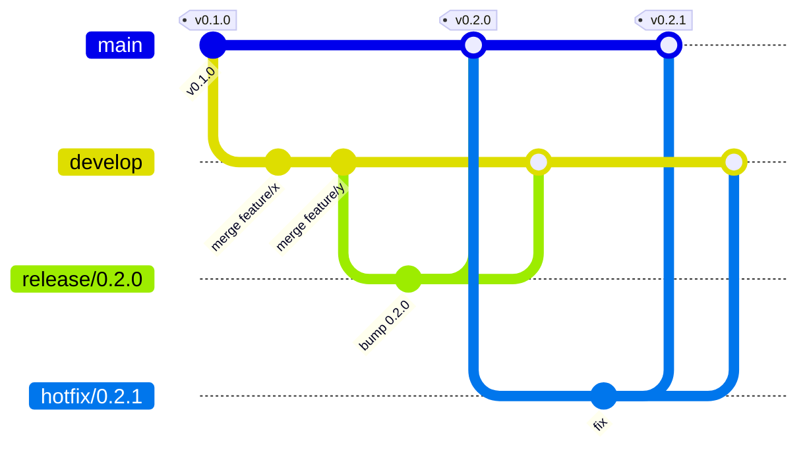

# Releasing

The repository follows **git flow** for branching and **semantic versioning** for releases. Versions are tagged `vMAJOR.MINOR.PATCH`; `package.json` at the root carries the same number and the `Release` workflow refuses a tag that does not match it.

## Branches



| Branch         | Purpose                                                                                         | CI                                                      |
| -------------- | ----------------------------------------------------------------------------------------------- | ------------------------------------------------------- |
| `main`         | Released code only. Every commit on it is a release or hotfix merge and carries a `v*` tag.     | `validate` matrix, **SAST**, **DAST**, docs publishing. |
| `develop`      | Integration branch; features land here through pull requests.                                   | `validate` matrix.                                      |
| `feature/*`    | One topic each, branched from `develop`, merged back by PR.                                     | `validate` matrix on the PR.                            |
| `release/X.Y`  | Stabilization before a release: version bump, changelog, last fixes. From `develop`, into both. | `validate` matrix on the PR to `main` (+ SAST, DAST).   |
| `hotfix/X.Y.Z` | Urgent fix on the released code. From `main`, into both.                                        | Same as a release.                                      |

The [git-flow (AVH edition)](https://github.com/petervanderdoes/gitflow-avh) CLI automates the branching; plain git works the same way. Initialize it once per clone with the defaults (`main`/`develop`, prefixes `feature/`, `release/`, `hotfix/`, tag prefix `v`):

```sh
git flow init -d -t v
```

## Day to day

```sh
git flow feature start my-topic        # = git checkout -b feature/my-topic develop
# … commits, npm run validate …
git push -u origin feature/my-topic     # open a PR against develop
git flow feature finish my-topic        # or merge the PR on GitHub and delete the branch
```

## Semantic versioning

`MAJOR.MINOR.PATCH` as in [semver.org](https://semver.org): while the project is `0.x`, every minor bump may break the API/contracts; patch bumps are fixes only. Bump **minor** for new features (a new route, a new tool for the AI, a new desk screen), **patch** for fixes and dependency updates without behavior changes, **major** for the first production-ready cut and any incompatible change afterwards.

The version lives in the root `package.json` only (the workspaces are private and unversioned). `CHANGELOG.md` has one section per release, written by hand from the merged pull requests.

## Cutting a release

```sh
git flow release start 0.2.0                      # branches release/0.2.0 from develop
npm version 0.2.0 --no-git-tag-version            # root package.json + package-lock.json
# add the 0.2.0 section to CHANGELOG.md, run npm run validate, npm run security
git commit -am "Release 0.2.0"
git flow release finish -m "Release 0.2.0" 0.2.0  # merges into main, tags v0.2.0, back-merges into develop
git push origin main develop --follow-tags
```

Pushing the `v0.2.0` tag triggers `.github/workflows/release.yml`, which checks that the tag matches `package.json` and creates the GitHub release with generated notes. Pushing `main` runs the full CI plus the SAST and DAST scans and publishes the docs site.

A hotfix is the same with `git flow hotfix start 0.2.1` from `main` and `git flow hotfix finish`.

Without the git-flow CLI:

```sh
git checkout -b release/0.2.0 develop
# bump, changelog, validate, commit
git checkout main && git merge --no-ff release/0.2.0 && git tag -a v0.2.0 -m "Release 0.2.0"
git checkout develop && git merge --no-ff release/0.2.0 && git branch -d release/0.2.0
git push origin main develop --follow-tags
```
