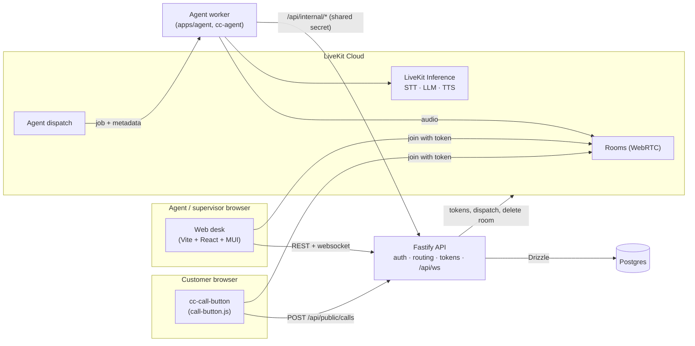

# Patchbay Contact Center

An AI-first, multi-tenant contact center proof of concept built on [LiveKit Cloud](https://cloud.livekit.io/). A customer presses a `<cc-call-button>` embedded on any website and talks over WebRTC; an AI voice agent answers (or, per tenant, humans are rung first) and can escalate to a human agent who joins the very same LiveKit room from a React desk. Every transcript segment, participant and call event lands in Postgres so an LLM can act on the conversation later. The whole repo is an npm-workspaces monorepo kept under a hard budget of 50k non-blank product lines (tests budgeted separately). Where it is going: the [Roadmap](/docs/guide/roadmap).

## Start here

1. [Getting started](/docs/guide/getting-started) — prerequisites, `.env.local`, Postgres, Google OAuth, the four dev servers and your first call.
2. [Architecture](/docs/guide/architecture) — workspaces, the system diagram, end-to-end sequence diagrams and the design decisions behind them.
3. [Call lifecycle](/docs/guide/call-lifecycle) — call statuses, every `call_event` type, participant identities and where transcripts come from.
4. The co-located READMEs of each app: [API](/apps/api/), [AI agent](/apps/agent/), [Web desk](/apps/web/), [Embed button](/apps/embed/), [Shared contracts](/packages/shared/).
5. [API reference](/docs/api/) — generated by typedoc from the doc comments in the source.

Also: [Testing](/docs/guide/testing), [Quality gates](/docs/guide/quality-gates), [Deployment](/docs/guide/deployment) and the [Glossary](/docs/guide/glossary).

## The system at a glance

