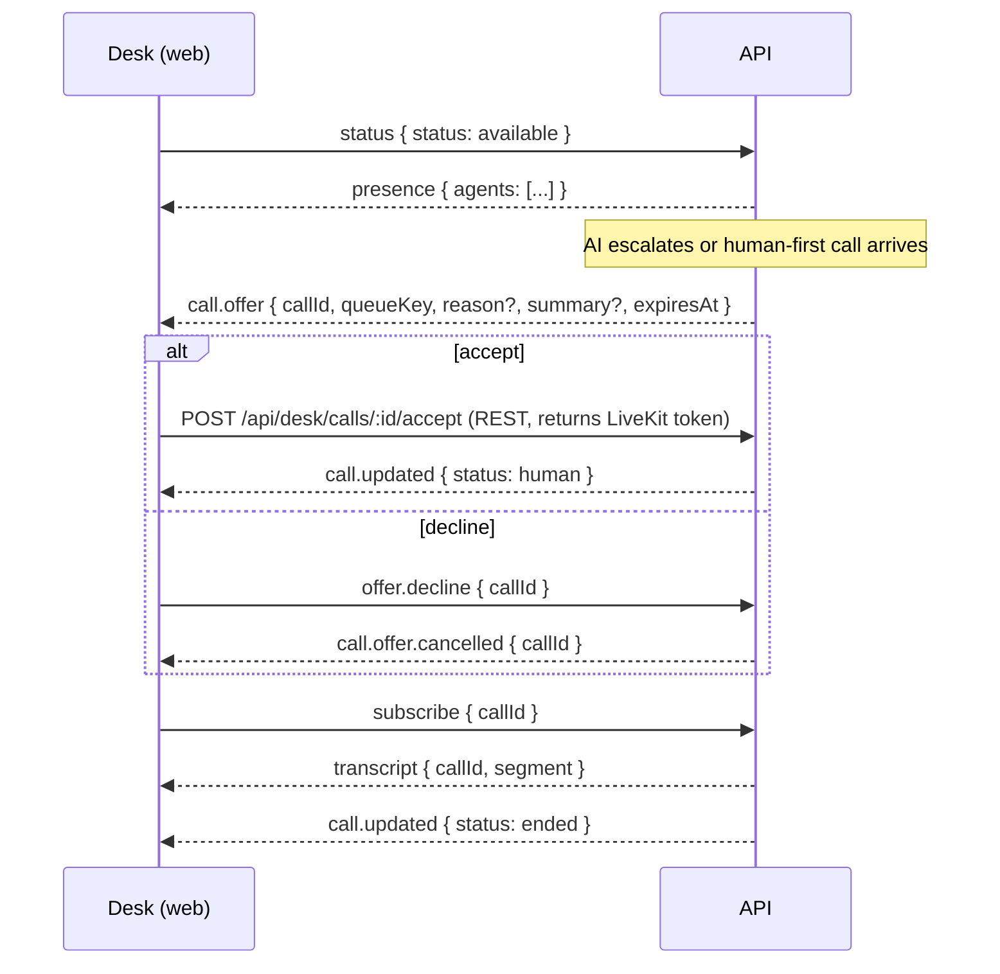
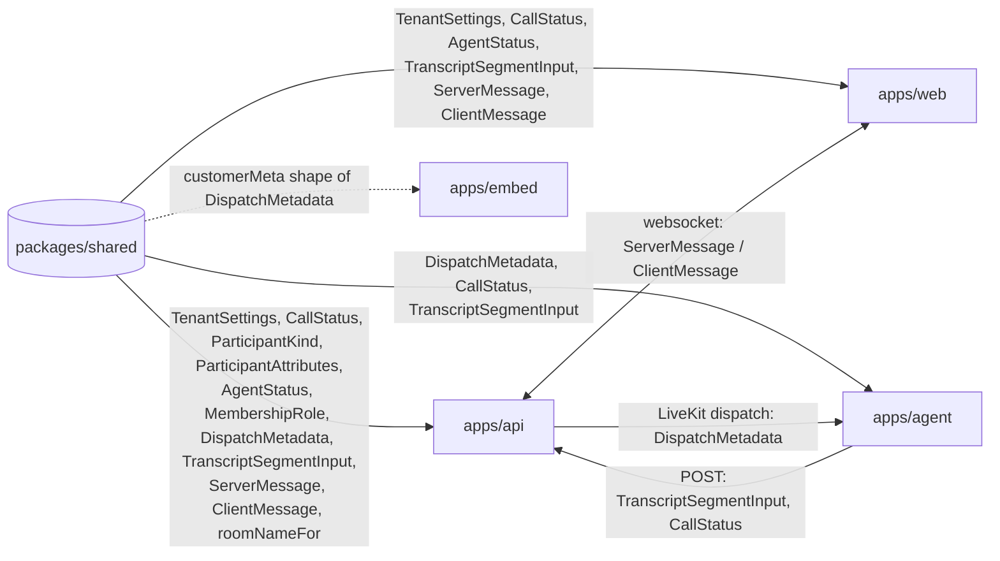

# Shared contracts (`packages/shared`)

`@cc/shared` is a tiny workspace package with a single file, `src/index.ts`, that holds every data shape crossing a process boundary in the contact center: tenant settings, call and participant enums, the metadata passed to the AI worker, transcript segments and the desk websocket protocol. It is the **single source of truth** for the API, the AI agent, the web desk and the embed button.

## Why a shared zod package

- **One definition, four consumers.** The API validates incoming JSON with a schema, the agent parses the job metadata with the same schema, and the web/embed clients use the inferred TypeScript types. A field renamed in one place fails typecheck everywhere else.
- **Runtime validation where the data is untrusted.** Settings come from a database column, dispatch metadata travels through LiveKit as a string, websocket frames come from a browser. `Schema.parse(json)` at the boundary turns "probably right" into "guaranteed right or throws".
- **Defaults live with the schema.** `TenantSettings.parse({})` yields a complete, valid configuration. That is how old rows and old clients keep working after a new field is added (see [Evolving a contract](#evolving-a-contract-safely)).
- **No build step.** `package.json` exports `./src/index.ts` directly; every workspace imports the source. Each schema is exported twice under the same name: the validator (`const`) and the inferred type (`type`).

```ts
import { type CallStatus, TenantSettings } from '@cc/shared';

const settings = TenantSettings.parse(rowFromDb.settings); // validator
const status: CallStatus = 'ai'; // type
```

## Schemas

| Schema                   | Models                                                           | Produced by                                                                     | Consumed by                                                                               |
| ------------------------ | ---------------------------------------------------------------- | ------------------------------------------------------------------------------- | ----------------------------------------------------------------------------------------- |
| `RoutingMode`            | Who answers first: `ai-first` or `human-first`                   | Web settings page (supervisor)                                                  | API `routes/public.ts` when creating a call                                               |
| `HandoffBehavior`        | What the AI does when a human joins: `leave` or `listen`         | Web settings page                                                               | Agent `main.ts` (`onHumanJoined`)                                                         |
| `TenantSettings`         | Per-tenant configuration JSON                                    | Web settings page → API `routes/admin.ts` (validated, stored on the tenant row) | API (routing), agent (inside `DispatchMetadata`), web (form)                              |
| `defaultTenantSettings`  | Helper returning `TenantSettings.parse({})`                      | —                                                                               | API `services/tenants.ts` (new tenants), tests                                            |
| `CallStatus`             | Call lifecycle enum                                              | API (`flow.ts`, `routes/internal.ts`); agent sends `ended`                      | Web desk call list, `ServerMessage.call.updated`                                          |
| `ParticipantKind`        | Who a participant is                                             | API tokens, agent attributes                                                    | Agent (`role` checks), API `services/calls.ts` (participants table, transcript `speaker`) |
| `ParticipantAttributes`  | LiveKit participant attributes (`role`, `userId`, `displayName`) | API `livekit.ts` (baked into tokens), agent `setAttributes`                     | Agent (detect humans); the web reads them from the LiveKit room, not from this package    |
| `AgentStatus`            | Desk presence: `available`, `busy`, `away`                       | Web desk (`ClientMessage.status`), API `routing.ts` (`busy` while on a call)    | API routing (only `available` agents are rung), web presence list                         |
| `MembershipRole`         | `agent` or `supervisor` inside a tenant                          | API `routes/admin.ts` (invites)                                                 | API route guards; the web only sees it as a string in API responses                       |
| `DispatchMetadata`       | Everything the AI worker needs for one call                      | API `routes/public.ts` / `flow.ts` (`JSON.stringify`)                           | Agent `main.ts` (`DispatchMetadata.parse(ctx.job.metadata)`)                              |
| `TranscriptSegmentInput` | One transcript line                                              | Agent `api.ts` (`POST /transcript`)                                             | API `routes/internal.ts` (validate, store), web (via `ServerMessage.transcript`)          |
| `ServerMessage`          | API → desk websocket frames                                      | API `ws.ts`, `flow.ts`, `routing.ts`                                            | Web `lib/store.ts`                                                                        |
| `ClientMessage`          | Desk → API websocket frames                                      | Web `lib/store.ts`                                                              | API `ws.ts`                                                                               |
| `roomNameFor`            | `cc-<tenantId>-<callId>`                                         | API `routes/public.ts`                                                          | — (the agent receives the room from LiveKit)                                              |

The embed button only talks to `POST /api/public/calls` and LiveKit; it shares the `customerMeta` shape of `DispatchMetadata` and the `ParticipantKind` value `customer`.

### Enum values

- `CallStatus`: `ringing` (row just created, routing decision pending) → `ai` (AI handling) or `waiting_human` (humans being rung, after an escalation or in human-first mode) → `human` (a human accepted and joined) → `ended` (terminal; room deleted, summary stored).
- `ParticipantKind`: `customer` (`customer:<callId>`), `ai` (`ai:<callId>`, while speaking), `human` (`human:<userId>`), `supervisor` (`supervisor:<userId>`, listen-only), `transcriber` (the AI worker after a `leave` handoff).
- `AgentStatus`: `available` (can be rung), `busy` (on a call or manually unavailable), `away`.
- `MembershipRole`: `agent` (takes calls), `supervisor` (also edits settings, queues, embed keys, invites; can listen in or take over).

## Desk websocket protocol

The web desk keeps one websocket per signed-in user (`apps/api/src/ws.ts`). Frames are JSON objects discriminated on `type`: the API parses incoming frames with `ClientMessage` and types outgoing ones as `ServerMessage`; the web desk uses the inferred types.



### API → desk (`ServerMessage`)

| `type`                 | Fields                                                   | Sent to                 | Meaning                                                                                                                                                         |
| ---------------------- | -------------------------------------------------------- | ----------------------- | --------------------------------------------------------------------------------------------------------------------------------------------------------------- |
| `call.offer`           | `callId`, `queueKey`, `reason?`, `summary?`, `expiresAt` | one user                | You are being rung. `reason`/`summary` come from the AI's `escalateToHuman` call; absent in human-first. `expiresAt` is when the offer moves to the next agent. |
| `call.offer.cancelled` | `callId`                                                 | one user                | The offer is no longer yours (timed out, taken by someone else, or the call ended).                                                                             |
| `call.updated`         | `callId`, `status: CallStatus`                           | whole tenant            | The call changed status.                                                                                                                                        |
| `presence`             | `agents[]: { userId, name, status, callId }`             | whole tenant            | Full snapshot of who is online and on which call.                                                                                                               |
| `transcript`           | `callId`, `segment: TranscriptSegmentInput`              | subscribers of the call | A new transcript line.                                                                                                                                          |

### Desk → API (`ClientMessage`)

| `type`          | Fields                | Meaning                                                  |
| --------------- | --------------------- | -------------------------------------------------------- |
| `status`        | `status: AgentStatus` | Set my presence.                                         |
| `offer.decline` | `callId`              | Pass on the current offer; the API rings the next agent. |
| `subscribe`     | `callId`              | Start receiving `transcript` frames for this call.       |

Accepting an offer is deliberately a REST call (`POST /api/desk/calls/:id/accept`), not a websocket message, because the response carries the LiveKit token needed to join the room.

## `TenantSettings` reference

| Field                  | Type / range                | Default                                      | Used by                                                                                       |
| ---------------------- | --------------------------- | -------------------------------------------- | --------------------------------------------------------------------------------------------- |
| `routingMode`          | `ai-first` \| `human-first` | `ai-first`                                   | API when creating a call: dispatch the AI now, or ring humans first.                          |
| `handoff.aiBehavior`   | `leave` \| `listen`         | `leave`                                      | Agent when a human joins.                                                                     |
| `humanFirstTimeoutSec` | integer 5–300               | `30`                                         | API, human-first only: total ring time before falling back to the AI.                         |
| `offerTimeoutSec`      | integer 5–120               | `20`                                         | API: how long each agent's offer rings. The agent passes it as `ringSec` to `POST /escalate`. |
| `aiAgent.instructions` | string, max 8000 chars      | `''`                                         | Agent: appended to the base prompt under "Company instructions".                              |
| `aiAgent.greeting`     | string, max 500 chars       | `Greet the caller and ask how you can help.` | Agent: instruction for the first reply (it is not read out literally).                        |

Nested objects use `.prefault({})` so that a row with `{}` or a missing `handoff` key still parses.

## Evolving a contract safely

Every consumer parses with the same schema, so a breaking change breaks all four apps at once. The safe recipe:

1. **Add, do not rename or remove.** New fields go in as optional or with a `.default(...)`; new enum values are appended. Stored tenant settings and in-flight dispatch metadata from older API versions must still parse.
2. **Give nested objects `.prefault({})`** so an absent object still gets its defaults.
3. **Do not bump a version.** There is no version field and no build; the workspace always imports the current source.
4. **Document the field** in the TSDoc of the schema (and its meaning per enum value); the typedoc build fails on undocumented exports.
5. **Run `npm test`** from the root. `src/index.test.ts` pins the defaults (`fills every default from an empty object`), and the API, agent and web suites exercise the consumers. Then `npm run typecheck`.
6. If a consumer must change (for example the desk store handling a new `ServerMessage` variant), ship the schema change and the consumer change together; the discriminated unions reject unknown `type` values rather than ignoring them.

Removing a field or enum value is a coordinated change: migrate stored rows first, then remove it from the schema and fix every typecheck error.

## Who imports what



## Files

| File                | Purpose                                                    |
| ------------------- | ---------------------------------------------------------- |
| `src/index.ts`      | All schemas, types and the `roomNameFor` helper.           |
| `src/index.test.ts` | Unit tests: defaults, JSON round-trip, message validation. |
| `package.json`      | Exports `./src/index.ts`; the only dependency is `zod`.    |
